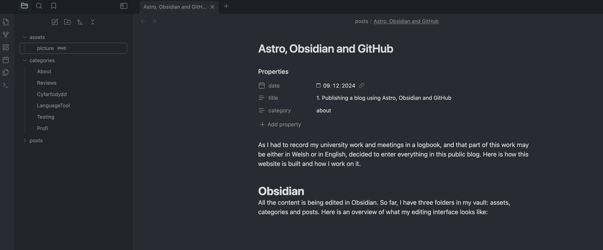

As I had to record my university work and meetings in a logbook, and that part of this work may be either in Welsh or in English, decided to enter everything in this public blog. Here is how this website is built and how I work on it.


## Obsidian
All the content is being edited in Obsidian. So far, I have three folders in my vault: assets, categories and posts. Here is an overview of what my editing interface looks like:



Before you ask, yes, the dark theme in this blog comes from this brillant "Atom" custom theme in Obsidian. Now, the only thing that might look a bit unusual to people unfamiliar with the specifics of markdown (file format used by obsidian under the hood) the the properties in the top of the post, these are called a front matter. In the editing mode they are parse by the obsidian app, but here is what this section for this file would look like if opened by another text editor:

```
---
date: 2024-12-09
title: 1. Publishing a blog using Astro, Obsidian and GitHub
category: about
---
```

But obsidian is not the only app build on top of the markdown format, or at least, able to parse MD front matters: Astro can it too! 
Astro, yes you know it, as in, the server rendered static website framework.

And because both can parse MD so well, I decided to try publishing this obsidian vault with it.

## Introducing: Astro
Astro is a framework that mixes the strength of modern frameworks with the efficiency of the good ol' server rendering. How? By building a copy of all the pages on the server before starting to serve them. Even the JS/TS of the front-end is rendered on a front-end engine in the server, unless otherwise specified, and the only thing the server has to do when recieving a request is to serve pure HTML and CSS. No need for API calls to populate the pages after they are opened by the client, even though these pages might be built in your favorite front end framework of the week.
All of the content of the website can be contained in the `./src/content/` directory in the markdown format. And you gessed it, this `/content` directory is nothing less than... my obsidian vault! 

## With GitHub
All the instructions to build an Astro website can be found in their documentation. But what you can also find in their docs is [this tutorial](https://docs.astro.build/en/guides/deploy/github/) to deploy your astro project as your GitHub website.
Follow these instructions and simply push your repo to a GitHub remote named [{your GH pseudo}.github.com](https://pages.github.com/) and let the magic GitHub Actions CI pipeline do the rest! 

## Pro tip: Type Check Your Frontmatters
As you are likely to use the data in the frontmatter of your md files. You don't want the one misconfigured frontmatter to ruin your website. That's why you should use TypeScript in combination with [Zod](https://zod.dev/). It is quite simple to do, simply create a `config.ts` file in the `/content` directory adapt this schema for your needs:

```TS
import { defineCollection, reference, z } from 'astro:content'

export const collections = {
	categories: defineCollection({
		type: 'content',
		schema: z.object({
		title: z.string(),
		description: z.string(),
		id: z.number(),
		}).strict(),
	}),
	posts: defineCollection({
		type: 'content',
		schema: z.object({
		title: z.string(),
		date: z.date(),
		category: reference('categories'),
		}).strict(),
	})
};
```

And don't forget to run `npx astro sync`, every time you see astro telling you their is a problem with the typing of the frontmatter in a file you think is correct. That might same you a couple of time.

You're welcome!