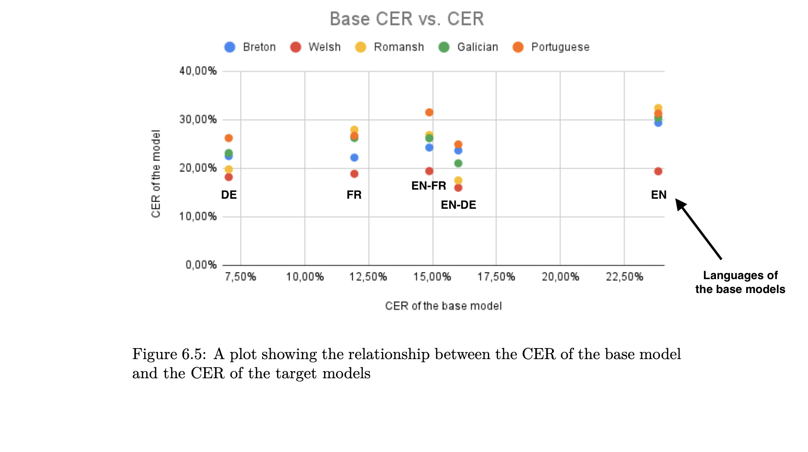

This is a review of the dissertation "Transfer Learning for Speech-to-Text: Investigating the Impact of the Base Language on the Performance of Models", 876 words. 

# Introduction
The dissertation stated goal is to confirm or disprove the hypothesis that the base language used to make speech-to-text models through transfer learning influences the performance of the models. This hypothesis means that phonetic similarities between the base and target languages influence the models' performance. If this proves to be true, the metrics correlating with accuracy improvements could help to optimize the base languages choice for different target languages in transfer learning for speech-to-text.  
Such optimization would extend the reach of the technology and the applications derived from it, avoiding a "digital death" of some languages. It is especially relevant for minority languages like Welsh and Breton, which are generally less studied in the literature and have to rely on smaller datasets in a field dominated by the neural network scaling law (Henighan, T. et al. 2020). This makes the topic relevant in regard to academia, but also the industry and those smaller linguistic communities.
# Research Design & Methodology
To answer the research question, models were built, and their accuracy was analysed. The character error rate (CER) is the main metric used to this end. It is based on the Levenshtein distance algorithm, commonly used in spellchecker algorithms. The CER is calculated by dividing the raw Levenshtein distance between strings (verified transcriptions against those obtained by the model) by their lengths. This normalization gives a score to the models which is independent of the languages, as the datasets in different languages vary in sizes. CER was preferred over either word or phoneme-based variations of the algorithm because of its bigger accuracy and versatility, respectively.  
Different ways to split the Common Voice dataset (for training, validation and testing) were evaluated to optimize the quality of the results.
# Key Findings & Arguments
Since the initial eight models trained in the fifth chapter did not show valid results, the core of the dissertation was extended to a sixth chapter with new models for more data points. A total of thirty models were trained and tested in the study, combining different French-, English- and German-based models for Breton, Romansh, Portuguese and Welsh. No more correlation were found based on phonemic metrics devised in the dataset analysis in Chapter 4. This has the virtue of confirming that a weak correlation that was found in Chapter 5 was solely due to the small amount of data points.  
The only valid correlation found in the dissertation is exposed in part 6.6.4. It states that the new models perform better when their base models also performed better for the base language, indifferently from the target.  
While the dissertation ends up rejecting the hypothesis, the author recognized that the metrics chosen to find correlations cannot encapsulate all aspects of language complexity. The sixth chapter closes on a comparison of the models trained for the study with state-of-the-art models. This comparison confirms the relevance of the transfer learning method to train highly accurate models.
# Critical Evaluation
The study could have shown non-linear correlations, i.e. an exponential drop in CER. Looking for Spearman correlations could have been better suited than the Pearson method because it is based on the rank of the data points instead of their raw value. In Figure 6.5, we see a relative (based on order) jump in accuracy for Romansh in the German and English-German-based models, as well as for Breton in the French-based model. Seeing a model trained and validated on four hours of data outperforming so many models does not look like a coincidence and, if nothing else, shows a relationship with geographic proximity.  
Which leads to the metrics. The proximity of the languages was calculated based on an IPA conversion of the transcriptions. As phonology is not phonetics, it is hard to see how any correlation could have been found based on these metrics. Prosodic proximity, however, could account for the surprising results mentioned above and the underperformance of the Portuguese model caused by the dataset split dialectal imbalance. The dialectal diversity of English also explain why its monolingual model performs worse than a specialized Romansh model. For English, the richer datasets and the lexical harmony do not seem compensate for the diversity of the prosodic structures in speech-to-text modeling. Yet, the digital study of prosody is relatively new, and understudied in minority languages like Breton (Kennard 2021), and out of the scope of expertise expected in the dissertation.  

# Conclusion
Based on its experiments, the dissertation refuted the hypothesis. However, absence of proof is not proof of absence, especially when language phonological proximity can hardly be accounted for in simple metrics, as the author pointed out.
Paradoxically, one of the main findings from the dissertation comes from the opposite direction of its stated goal. When looking for ways to improve the transfer learning method, some unexpected drops or jumps were found in the models performances, some likely due to accentual imbalance in the datasets. For this reason, these artefacts were sidelined, although the prosodic similarities may well be the key metric that could validate the hypothesis. This underlines the benefite of using exploratory methodologies, where results are showed first, and theories are designed later, allowing for more flexibility as the work progress.  
Despite its shortcomings, the rigorousness and perseverance displayed in the dissertation make its finding highly reproducible, consequently easing the continuation of the work by other researchers, who may well end up validating the original hypothesis after all.

#### References

- Henighan, T. _et al._ (2020) ‘Scaling Laws for Autoregressive Generative Modeling’. arXiv. Available at: https://doi.org/10.48550/arXiv.2010.14701.
- Kennard, H.J. (2021) ‘Variation in Breton word stress: new speakers and the influence of French’, _Phonology_, 38(3), pp. 363–399. Available at: https://doi.org/10.1017/S0952675721000245.