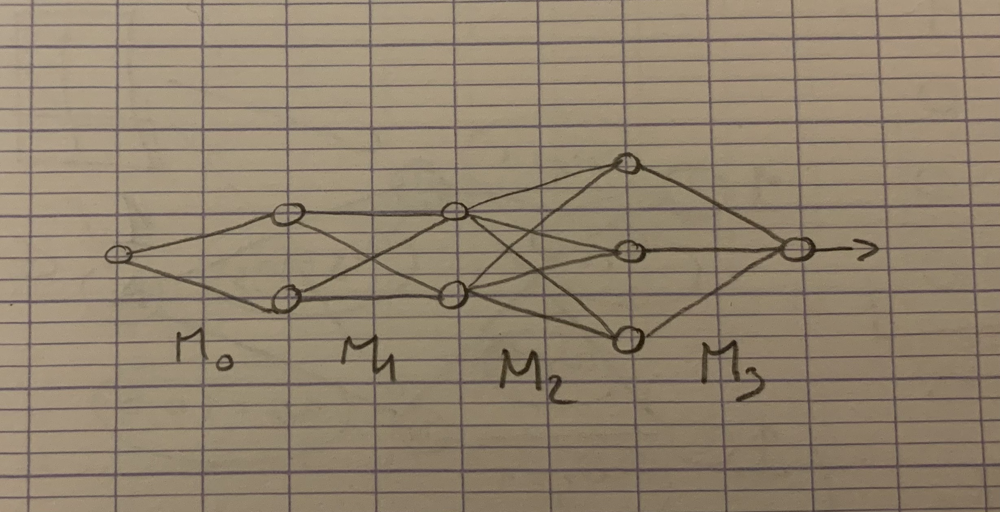

# 1 Ar matris evel taolenn

Matrisoù a zo diaes peogwir hon eus laket anezho da vezañ diaes. E gwirionez n'int nemet taolennoù a zo bet kuzhet ster o linennoù hag o c'holumnennoù diganto. Taolennoù difetisaet evit gallout implijout an holl anezho evel an heñvelep seurt a objed.
## 1.1 Daou rummad: ur rummad degas hag ur rummad digas

Ar ger rummad a zo pouezus kenañ en holl draoù matematikel. Henri Poincaré a lavare: "Reiñ an heñvelep anv da draoù disheñvel eo ar matematikoù." Da lavaret eo, gallout lakat traoù disheñvel en ur rummad boutin a zo holl ar pezh a ra ar vatematikourien. Ma fell deoc'h deskiñ muioc'h diwar-benn an dra-se e c'hallit klask ar lenn diwar-benn Teorienn ar rummadoù war internet (pe "Category Theory" e saozneg).
Gallout a reer gwelet ur matris evel un daolenn etre daou rummad enta. En tu kleiz e weler rummad ar mentad degas, hag en traoñ, rummad ar mentad digas. Hag etre an daou e kaver danvez ur "gartenn" evit mont eus ur mentad d'egile. Met a raok sevel ar gartenn-se, taolomp ur sell war un nebeut taolennoù:

## 1.2 Skouerioù taolennoù
### 1.2.1 Dispignoù en ur veaj e bro Itali

An daolenn-mañ (M0) a ziskouez keidenn ma dispignoù e-pad ur veaj e bro Itali:

|           | Deiz | Noz |
| --------- | ---- | --- |
| Dispignoù | 40€  | 60€ |
### 1.2.2 Dispignoù en ur veaj e bro Itali

An eil daolenn (M1) a ziskouez petra a zo bet dispignet war ar boued pe traoù all, e-pad an deiz pe e-pad an noz.

|      | Boued | All |
| ---- | ----- | --- |
| Deiz | 20%   | 80% |
| Noz  | 60%   | 40% |
### 1.2.3 Dispignoù en ur veaj e bro Itali

An trede (M2) a ziskouez eus pelec'h e teue an traoù-se am eus prenet.

|       | Lec'hel | Europa | Maez Europa |
| ----- | ------- | ------ | ----------- |
| Boued | 80%     | 10%    | 10%         |
| All   | 25%     | 50%    | 25%         |
### 1.2.4 Dispignoù en ur veaj e bro Itali

An daolenn ziwezhañ (M3) a ziskouez feur an taozioù disheñvel ar produioù hervez o lec'h orin:

|             | Taozioù |
| ----------- | ------- |
| Lec'hel     | 15%     |
| Europa      | 20%     |
| Maez Europa | 50%     |
# 2 Pep matris evel rouedad etre talvoudegezhioù degaset ha digaset
Pep bir a zo unan ur gellig en daolenn, a gas talvoudegezhioù eus mentad (rummad) an tu kleiz davet mentad an tu dehoù.

X1 -----> Y1  
	 \       /  
	X  
	/       \  
X2 -----> Y2  

Pa chadenner an holl daolennoù evel ur steudad rouedadoù en em gaver gant ur dra evel-se:

An dra-se a aotre ac'hanoc'h da vodelizañ, gant ur fonksion hollek, al lodenn resis eus an taozioù e-barzh an holl arc'hant dispignet en un devezh vakañsoù e bro Itali. Seul vuioc'h a vrankoù e-barzh ar rouedad-se, seul resisoc'h e vo ar modelizadur. Seul **zonoc'h** e vo ar rouedad, seul binvidikoc'h e vo e gomprenadur ha reizhoc'h e teu an disoc'h, gant nebeutoc'h a geleier. Da skouer, ma ouzhpenner M0 d'ar rouedad dre cheñch an arouez € gant %, kavout a reer e c'haller jeneralizañ feur an dispignoù e-pad an deiz hag en nozvezhioù ha magañ ar sistem gant ur varienn hepken, hep koll netra e kalite an disoc'h.
E bed an intant artifisiel e reer "parametroù" eus ar brankoù-se, pe c'hoazh "pouezioù". Neuze, pa glevit ez eus 220 miliard a barametroù en ur patrom yezh evel ChatGPT e c'hallit soñjal en ur rouedad gant kement a vrankoù etre e neudennoù...
Pal an intant artifisiel a zo bed e-pad pell da gavout ur mod efedus da lakat an urzhiataerioù da gavout tavoudegezhioù reizh ar parametroù, hep reiñ muioc'h dezho estreget ur bern parioù a dalvoudegezhioù  goulenn-respont pe "degas-digas". Er bloavezhioù 80 e voe kavet ur mod efedus da barametriñ ar pouezioù-se en ur rouedad neuronoù. Anvet e vez Treuzkas ar gradiant war-dreñv an algoritm-se.
Gant ma voe kavet an algoritm-se, an dae nevez evit an enklaskerien war an dachenn a voe da ijinañ stummoù rouedadoù nevez evit modelizañ keleier kemplezh da zielfennañ, evel skeudennoù, mouezh an dud hag evel-just, ar yezhoù denel. Ur wech pleustret da labourat en ur en ur ster, e c'haller ivez goulenn digant ur patrom da gavout ar goulenn diwar ur respont, bennak. Setu penaos eur gouest da lakat patromoù da broduiñ skeudennoù diwar testenn, ha kement all!
Met an dra-se a zo un istor evit un deiz all.
