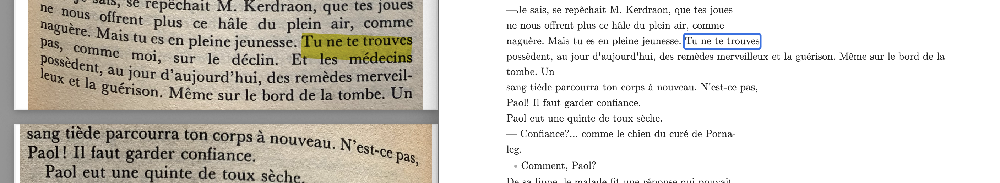
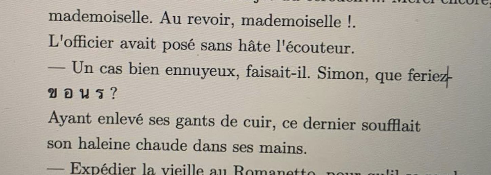

# Introduction
This corpus is a pair of books, the first in Breton "Itron Varia Garmez" (IVG), and its French autotranslation made by the author "Notre-Dame Bigoudène" (NDB). The books were originally published in the 1930-40s and are still protected by copyrights, so there is no legal digitalized version available online. Being in possession of the two books, I thought of scanning, cleaning and alinging the sentences of the books to create a parallel corpus (with the sentences order shuffled to ensure copyright compliance) that could be used to train and test machine translation models. Breton language being a language classed by the UNESCO as endangered, this kind of corpora bring a great value to the speaking community through the improvement they bring to these NLP tools and support the develpment and visibility of the language. Note that, unlike English and French, Breton language does not have dedicated modules in NLTK, spacy or other libraries, including the OCR libraries that I could otherwise have use below. Essentially, working with low resources languages forces use to be imaginative, but at least with the reward of knowing that no one else would have done the same thing elsewhere. But as we'll see, everything did not go as smoothly as expected. As usual, the whole code for this project is available on [Github](https://github.com/Oktogazh/NLP/tree/master/Corpus).

# Scanning the books
The longuest part of the work was by far the scanning of the two books. The Breton version having more than 350 pages and 238 pages for the French translation. Each page had to be photographed individualy and then cropped manually to ensure only the text of the book remains (and not the titles, page number etc...). Then, PDF files of 40 to 50 pages were generated from the heavy HD pictures containing only the text from the novel. After trying several optical character recocgnition (OCR) libraries and tools, it turned out that the best results came from MacOS's own PDF viewer. This is explainable by the fact that other tools are trained specifically to recognise words from predefined language, but no such tool exists for Breton language, where I needed a real character-based recongnition model. After the PDF viewer had scanned the entegrality of the PDF files, I could simply copy-past the recognised text to text files.

# Cleaning the texts
The text in the files contain line breaks at the same position as in the original texts, this can be used to spot easy mistakes made by the OCR system. For example, abnormally long lines may indicate a scanning mistake due to the curveture of the page in the picture like in this example:



In these cases, I could quickly find and correct the missing part, or reorder the sections of the sentence. Sometime, I would find unexpected characters like the French word "vous" being written with Tai characters here:



These examples highlight the need for linguistic expertise and mannual efforts to clean the collected data intead of trusting the technology to be always right.

But completely cleaning the text mannally is virtually impossible within the available timeframe. so I had to use programmatic methods to remove at least the most obvious mistakes.

Rough idea of the word count of the books by chapters:

| Chapters | IVG (Breton) | NDB (French) |
| -------- | ------------ | ------------ |
| 1        | 5 596        | 5 093        |
| 2        | 25 552       | 21 183       |
| 3        | 39 211       | 32 813       |
| total    | 70 359       | 59 089       |

For this I used a functional programming paradigm, without ever changing the original files, I applied layers of small modifications to the text files doing trials-and-error small corrections.

```python
# print length for each vairable
print("Breton text length:", len(breton))
print("French text length:", len(french))
# Breton text length: 391498
# French text length: 342861

# Split anywhere a punctuation followed by a space and a capital letter
breton_segments = re.split(r"(?<=[.!?\"\'])\s+(?=[A-Z])", breton)
french_segments = re.split(r"(?<=[.!?\"\'])\s+(?=[A-Z])", french)

print("Breton segments count:", len(breton_segments))
print("French segments count:", len(french_segments))
# Breton segments count: 4737
# French segments count: 3814

print("Breton segments example:", breton_segments[:3])
print("French segments example:", french_segments[:3])
# Breton segments example: ['Paol, emañ ho koan war an daol.', 'Deuit da zebriñ ho koan !"', 'Kleier Karmez o doa sonet an anjeluz.']
# French segments example: ['- Paol, votre dîner est sur la table.', "Les cloches des Carmes avaient sonné l'angélus.", "La paix du soir s'épandait sur la ville."]
```

And already the problem that I feared while originally scanning the books becomes blatant. Despite the two books being supposedly the same, the Breton version contains 518 more sentence than the French one... By having a quick look at the four first sentences, one can see that the two first sentences of the Breton text are actually translated by one sentence in the French text. nothing surprising as this problem seems to concern half a quarter of the sentences!... This is a problem that I did not foresee when selecting the text, an autotranslation is made by the author of the original text, who is the last person to care about being faithful to the source... And worse than this, segmentation is not the only problem, sometimes, like here in the beginning of the third chapter, it the French text that is significantly shorter and display informations in a different order:

| Breton Version                                                                                                                                                                                                                                                                                                                                                                                                                                                                                                                                                                                                                                                                                                                                                                                                                                                                                                                                                                                                                                                                                                                                                                                                                                                                                                                                                                                                                                           | French Translation                                                                                                                                                                                                                                                                                                                                                                                                      |
| -------------------------------------------------------------------------------------------------------------------------------------------------------------------------------------------------------------------------------------------------------------------------------------------------------------------------------------------------------------------------------------------------------------------------------------------------------------------------------------------------------------------------------------------------------------------------------------------------------------------------------------------------------------------------------------------------------------------------------------------------------------------------------------------------------------------------------------------------------------------------------------------------------------------------------------------------------------------------------------------------------------------------------------------------------------------------------------------------------------------------------------------------------------------------------------------------------------------------------------------------------------------------------------------------------------------------------------------------------------------------------------------------------------------------------------------------------- | ----------------------------------------------------------------------------------------------------------------------------------------------------------------------------------------------------------------------------------------------------------------------------------------------------------------------------------------------------------------------------------------------------------------------- |
| Kentañ hini a voe lazhet gant ar warded a voe ur vigoudenn gozh, bouzar ha dinoaz.<br>Tremenet e oant d'an daoulamm ruz, e-giz ar gurun. War o lerc'h, e voe dastumet, faoutet he fenn gant un taol pav marc'h, er gwad o poulladiñ war ar pavez, ar paourkaezh maouez kozh.<br>Gouzout a reas an dud hec'h anv gwirion, o lenn, antronoz, war ar c'hazetennoù, keloù an darvoud :<br>Anna Louiza Kerlorc'h, intañvez Per-Mari Moal.<br>Gouezet e voe ivez e oa oadet a driwec'h vloaz ha tri-ugent.<br>Dre ma oa krommedik he c'hein, Anna Gerlorc'h a oa, evit an holl, Naig Kein Aour, pe c'hoazh Nana Vihan kein-Grilh. Ouzhpenn hanter kant vloaz a oa e oa aet da anaon ar charretour Per-Mari Moal, he den.<br>Bevañ 'rae outi hec'h-unan, oc'h ober he c'halebeutenn hec'h-unan, e porzh Herri Gwichaoua, mestr-toer ar Ru Jean Jaurès, e-kichen an Ti Moged.<br>Gren e oa chomet daoust d'hec'h oad, ha ne choulenne ket klevout nevez eus ospital ar re gozh.<br>A-hend-al, avat, n'he doa ket nemeur a zarempred gant amezeien ar c'harter, rak pounnerglev e oa deut da vezañ, evel ma klemme. Komprenit e oa bouzar-kloc'h.<br>Ar yaouvezh-se ta, war dro div eur, e tiskenne Naig<br>Kein Aour, war he c'hoef-blev hag he chaosonoù,<br>dre-biou ar C'hastel war-du Koed Mene-Bihan.<br>Edo o vont da zastum ul liñseriad delioù pin. N'eus ket par d'an delioù pin kras da zisklaouañ tan pe da zerc'hel ur flamm ingal dindan ur billig, | Ce jeudi donc, vers 14 heures, Naïg au Dos d'or, en chaussons et bonnet sans coiffe, descendait, en longeant le Château, dans la direction du Bois de la Petite Colline.<br>Elle allait ramasser une serpilliérée d'aiguilles<br>de pin. Rien ne se compare aux aiguilles de pin sèches pour allumer un feu ou tenir une flamme régulière sous une tuile à crêpes.<br>Naïg était sourde et avait soixante-dix-huit ans. |

Finding out about this, I realized that the stated goal was not even a good idea, as the content of the books is too divergent to train translation models. So I had to change my plan.

# Train two monolingual embedding models with Word2Vec
We start by reusing the cleaning function from a previous lab with a small twist to allow the Breton trigram "c'h" to be preserved despite the apostrophy in the middle, and to remove the first letter in French contractions followed by the apostrophy (l', d', c'...). This cleaning underscores the importance of having people with languages-specific expertise in NLP, especially in the domain of lower resourses languages.

```python
def clean_text(text):
    # Cleans the given text using regular expressions to split and lower-cased versions to create
    # a list of tokens for each text.

    # lower case
    tokens = re.split(r"[\s\n.–]+", text.replace("—", " ").replace("c'h", "cvvh"))
    tokens = [t.lower() for t in tokens]
    tokens = [
        (
            t[2:]
            if len(t) > 2 and t[1] == "'" and (t[2] in "eaiou" or t[0] in "lmtdjs")
            else t
        )
        for t in tokens
    ]

    # remove punctuation using regular expressions
    # this line of code locates the punctuation within the given text and compiles that punctuation into a single variable
    re_punc = re.compile("[%s]" % re.escape(string.punctuation))
    # this line of code substitutes the punctuation we just compiled with nothing ''
    tokens = [re_punc.sub("", token) for token in tokens]

    # only include tokens that aren't numbers
    tokens = [token.replace("cvvh", "c'h") for token in tokens if token]
    return tokens


clean_breton_segments = []
for x in breton_segments:
    clean_breton_segments.append(clean_text(x))

clean_french_segments = []
for x in french_segments:
    clean_french_segments.append(clean_text(x))

print(clean_breton_segments[:3])
print(clean_french_segments[:3])
# [['paol', 'emañ', 'ho', 'koan', 'war', 'an', 'daol'], ['deuit', 'da', 'zebriñ', 'ho', 'koan'], ['kleier', 'karmez', 'o', 'doa', 'sonet', 'an', 'anjeluz']]
# [['paol', 'votre', 'dîner', 'est', 'sur', 'la', 'table'], ['les', 'cloches', 'des', 'carmes', 'avaient', 'sonné', 'angélus'], ['la', 'paix', 'du', 'soir', 'épandait', 'sur', 'la', 'ville']]
```
We can then create the model:
```python

# Train Word2Vec model for Breton
breton_model = Word2Vec(
    sentences=clean_breton_segments, vector_size=128, window=5, min_count=3
)
breton_model.save("breton_word2vec.model")

# Train Word2Vec model for French
french_model = Word2Vec(
    sentences=clean_french_segments, vector_size=128, window=5, min_count=3
)
french_model.save("french_word2vec.model")
```

# Next
The only interresting thing to do going forward is to try to align the embeddings to try to generate a French-Breton dictionary from them with tools like Meta's [MUSE](https://github.com/facebookresearch/MUSE) library. Unfortunately, the mannual preparation and cleaning work of the text took me too much time and I could not learn and push this analysis further in the required time. but depending when you read this, you can always check the [repository on github](https://github.com/Oktogazh/NLP/tree/master/Corpus) and see if I ended up creating a translation dictionary since the report was written.