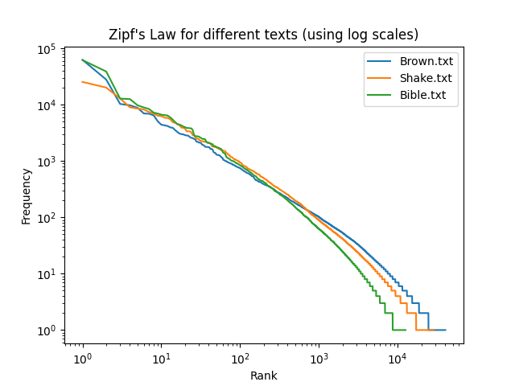
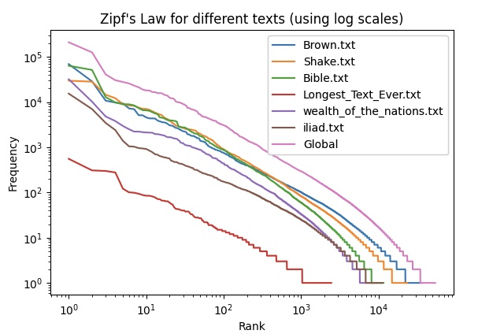
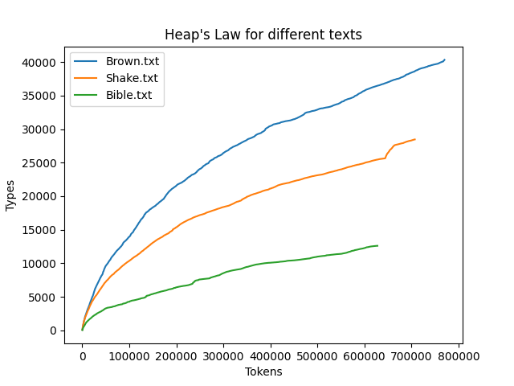
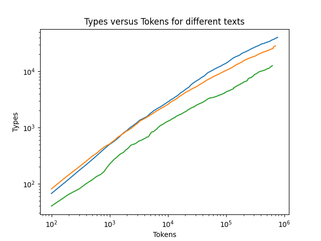
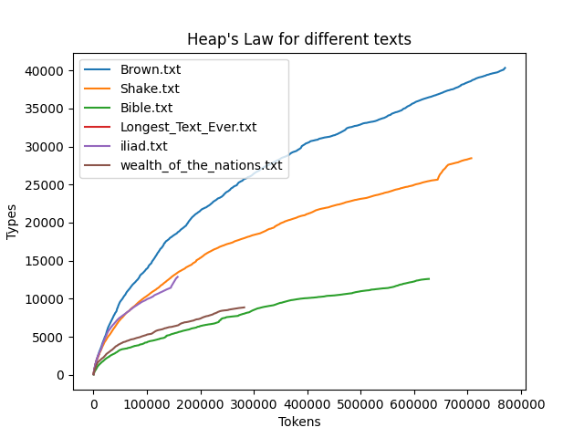
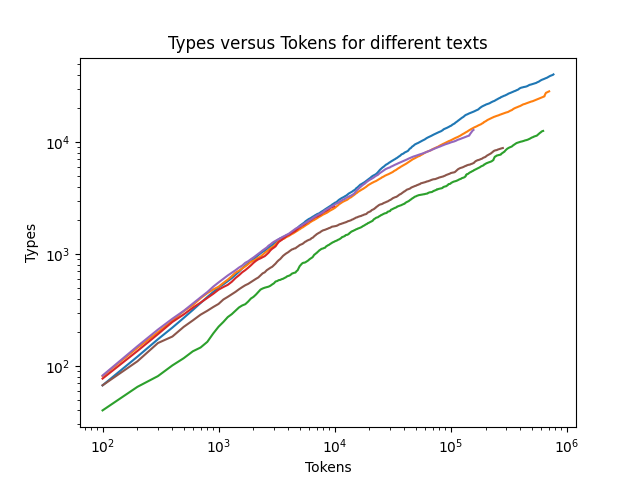

<iframe src="../assets/nlp-lab-1.pdf" style="min-height: 90vh"/>

<!--
> The repository for this class can be found [here on GitHub](https://github.com/Oktogazh/NLP/tree/master/Lab_01).
# Exercise 1.1 Basic Encryption Using Python

```python
"""
convertupper.py
"""

cesars_dictionary = {i: 93 + (94 - i) for i in range(65, 123)}
print(cesars_dictionary)
  

def capitalize(filename):
	"""Creates a new file with the prefix 'encrypted_'
	added to the name of the original file.
	Then translates the characters using Cesar's cypher algorithm."""
	
	with open(filename, "r") as infile:
		with open("encrypted_" + filename, "w") as outfile:
			for line in infile:
			new_line = line[::-1].translate(cesars_dictionary)
			print(new_line)
			print(new_line, file=outfile)

  
  

# output
"""
{65: 122, 66: 121, 67: 120, 68: 119, 69: 118, 70: 117, 71: 116, 72: 115, 73: 114, 74: 113, 75: 112, 76: 111, 77: 110, 78: 109, 79: 108, 80: 107, 81: 106, 82: 105, 83: 104, 84: 103, 85: 102, 86: 101, 87: 100, 88: 99, 89: 98, 90: 97, 91: 96, 92: 95, 93: 94, 94: 93, 95: 92, 96: 91, 97: 90, 98: 89, 99: 88, 100: 87, 101: 86, 102: 85, 103: 84, 104: 83, 105: 82, 106: 81, 107: 80, 108: 79, 109: 78, 110: 77, 111: 76, 112: 75, 113: 74, 114: 73, 115: 72, 116: 71, 117: 70, 118: 69, 119: 68, 120: 67, 121: 66, 122: 65}

  

.MLRGZIZKVH VSG LG NVSG OVKNR SXRSD HVHFZX VSG VIZOXVW WOFLSH BVSG GZSG HVIRFJVI WMRPMZN UL HMLRMRKL VSG LG GXVKHVI GMVXVW Z ,NVSG VOGRGMV WLt H'VIFGZm UL WMZ VIFGZm UL HDZo VSG SXRSD LG MLRGZGH OZFJV WMZ VGZIZKVH VSG ,SGIZV VSG UL HIVDLK VSG TMLNZ VNFHHZ LG WMZ ,IVSGLMZ SGRD NVSG WVGXVMMLX VEZS SXRSD HWMZY OZXRGROLK VSG VEOLHHRW LG VOKLVK VML ILU BIZHHVXVM HVNLXVY GR ,HGMVEV MZNFS UL VHIFLx VSG MR MVSd

.WOILD WRWMZX Z LG WVGGRNYFH VY HGXZu GVO ,HRSG VELIK Lg .HVGZGh VHVSG IVEL BMMZIBg VGFOLHYZ MZ UL GMVNSHROYZGHV VSG GXVQYL GXVIRW MR TMREZS OOZ ,HMLRGZKIFHF WMZ HVRIFQMR WVGZVKVI UL BILGHRS Z HR MRZGRIy GZVIt UL TMRp GMVHVIK VSG UL BILGHRS VSg .GMVNMIVELt UL HNVGHBh IVNILU IRVSG IVGOZ LG NVSG HMRZIGHMLX SXRSD BGRHHVXVM VSG DLM HR SXFH WMZ ;HVRMLOLx VHVSG UL VXMZIVUUFH GMVRGZK VSG MVVY HZS SXFh--.BGRIFXVH VIFGFU IRVSG ILU HWIZFt DVM VWRELIK LG WMZ ,GMVNMIVELt SXFH UUL DLISG LG ,BGFW IRVSG HR GR ,GSTRI IRVSG HR GR ,NHRGLKHVw VGFOLHYZ IVWMF NVSG VXFWVI LG MTRHVW Z HVXMREV GXVQYl VNZH VSG BOYZRIZEMR TMRFHIFK ,HMLRGZKIFHF WMZ HVHFYZ UL MRZIG TMLO Z MVSD GFy .WVNLGHFXXZ VIZ BVSG SXRSD LG HNILU VSG TMRSHROLYZ BY HVEOVHNVSG GSTRI LG MZSG ,VOYZIVUUFH VIZ HOREV VORSD ,IVUUFH LG WVHLKHRW VILN VIZ WMRPMZN GZSG ,MDVSH SGZS VXMVRIVKCV OOZ BOTMRWILXXZ WMZ ;HVHFZX GMVRHMZIG WMZ GSTRO ILU WVTMZSX VY GLM WOFLSH WVSHROYZGHV TMLO HGMVNMIVELt GZSG VGZGXRW OORD ,WVVWMR ,VXMVWFIk .HHVMRKKZs WMZ BGVUZh IRVSG GXVUUV LG BOVPRO GHLN NVVH OOZSH NVSG LG HZ ,NILU SXFH MR HIVDLK HGRTMRARMZTIL WMZ HVOKRXMRIK SXFH ML MLRGZWMFLU HGR TMRBZO ,GMVNMIVELt DVM VGFGRGHMR LG WMZ ,GR SHROLYZ LG IL IVGOZ LG VOKLVk VSG UL GSTRi VSG HR GR ,HWMV VHVSG UL VERGXFIGHVW HVNLXVY GMVNMIVELt UL NILu BMZ IVEVMVSD GZSg-- ,WVMIVELT VSG UL GMVHMLX VSG NLIU HIVDLK GHFQ IRVSG TMRERIVW ,MVn TMLNZ WVGFGRGHMR VIZ HGMVNMIVELt ,HGSTRI VHVSG VIFXVH LG GZSg--.HHVMRKKZs UL GRFHIFK VSG WMZ BGIVYRo ,VURo VIZ VHVSG TMLNZ GZSG ,HGSTRi VOYZMVROZMF MRZGIVX SGRD ILGZVIx IRVSG BY WVDLWMV VIZ BVSG GZSG ,OZFJV WVGZVIX VIZ MVN OOZ GZSG ,GMVWREV-UOVH VY LG HSGFIG VHVSG WOLS Vd
"""
```

# Exercise 1.2 Coping with Noisy Text
The program does not lematize the words before or after grouping them by length, the special characters `' -- , ` etc.. are present, in some cases, two different words are grouped together. Here is my proposed correction, without use NLTK.

```python
""" Uses a dictionary to group the words in a text file according to
their length (number of letters). """

import sys # For argv global command line arguments list

def main():
	"""Group the words by length in a text file."""
	if len(sys.argv) < 2: # Did the user not supply a file name?
		print("Usage: python groupwords.py <filename>")
		print(" where <filename> is the name of a text file.")
	else: # User provided file name
		filename = sys.argv[1]
		groups = {} # Initialize grouping dictionary
		with open(filename, "r") as f: # Open the file for reading
			content = f.read() # Read in content of the entire file
			words = (
				content.replace("'s", " 's")
				.replace("n't", "")
				.replace(".", " ")
				.replace("--", " ")
				.split()
			) # Make list of individual words, remove some punctuation
			
			for word in words:
				word = word.lower() # Make the word all in lower case
				# Compute the word's length
				size = len(word)
				if size in groups:
				if word not in groups[size]: # Avoid duplicates
					groups[size] += [word] # Add the word to its group
				else:
					groups[size] = [word] # Add the word to a new group
			
			# Show the groups
			for size, group in sorted(groups.items()):
				print(size, ":", group)

if __name__ == "__main__":
	main()
  

# output
"""
1 : ['a']
2 : ['in', 'of', 'it', 'to', "'s", 'we', 'be', 'by', 'is', 'or', 'on', 'as', 'an']
3 : ['the', 'for', 'one', 'and', 'god', 'all', 'men', 'are', 'any', 'it,', 'new', 'its', 'not', 'but', 'off', 'has', 'now', 'let']
4 : ['when', 'have', 'them', 'with', 'laws', 'that', 'they', 'hold', 'men,', 'just', 'from', 'form', 'such', 'seem', 'most', 'will', 'long', 'hath', 'more', 'than', 'same', 'been', 'king', 'over']
5 : ['human', 'bands', 'which', 'among', 'equal', 'them,', 'impel', 'these', 'their', 'life,', 'ends,', 'right', 'alter', 'form,', 'shall', 'light', 'while', 'evils', 'forms', 'train', 'under', 'duty,', 'throw', 'great', 'prove', 'this,', 'facts', 'world']
6 : ['course', 'people', 'assume', 'powers', 'earth,', 'nature', 'decent', 'should', 'causes', 'truths', 'equal,', 'secure', 'laying', 'likely', 'effect', 'safety', 'shewn,', 'abuses', 'object', 'design', 'reduce', 'right,', 'guards', 'future', 'former', 'having', 'direct', 'states', 'candid']
7 : ['events,', 'becomes', 'station', 'entitle', 'respect', 'mankind', 'declare', 'created', 'endowed', 'creator', 'certain', 'rights,', 'liberty', 'pursuit', 'consent', 'abolish', 'indeed,', 'dictate', 'changed', 'causes;', 'suffer,', 'evinces', 'provide', 'patient', 'systems', 'history', 'present', 'britain', 'tyranny']
8 : ['dissolve', 'another,', 'separate', 'opinions', 'requires', 'deriving', 'whenever', 'disposed', 'pursuing', 'absolute', 'security', 'repeated', 'injuries']
9 : ['necessary', 'political', 'connected', 'happiness', 'governed,', 'institute', 'prudence,', 'transient', 'colonies;', 'necessity', 'submitted']
10 : ['separation', 'instituted', 'government', 'foundation', 'principles', 'experience', 'themselves', 'abolishing', 'accustomed', 'invariably', 'despotism,', 'sufferance', 'constrains']
11 : ['unalienable', 'governments', 'destructive', 'government,', 'established', 'accordingly', 'sufferable,']
12 : ['usurpations,']
13 : ['self-evident,', 'organizingits', 'establishment']
"""
```

# 1.3 Understand Zipf's Law



This graph shows the correlation between orders and frequency for three English corpora. It uses a logarithmic scale to make the correlation more obvious. As the number of words become more significant, this logarithmic representation looks more linear (in the graph), and yields what would be called a [harmonic progression](https://en.wikipedia.org/wiki/Harmonic_progression_(mathematics)) of the shape for $f(x)=\frac{1}{r^{x}}=r^{-x}$ where $r$ is the rank of the word, and $x$ a constant that can vary depending on the source, especially the language. If a Spearman correlation was expected here, the presence of a strong Pearson correlation would be expected if they were to be normalized, which is less obvious.  



To illustrate this prediction – that is, as the corpus grow, the logarithmic representation gives an ever straighter line – I tried to add another text and to sum the frequencies between different texts all together. As we can see, the purple line is slightly more straight than the others. Although I tried to find a long text, we can see another interesting aspect of the Zipf's law with the new text added. The order of magnitude of the length of the so-called "Longest Text Ever" is not big enough to influence the total significantly and a hollow is observed in the total, where a bump is found in this other text. I decided to keep it to highlight this property of the logarithmic distribution. To try to have better results, I tried to lower the casing of all words before adding them in the frequency dictionaries. It is still not a perfect line, though.  

```python
from matplotlib import pyplot as plt

import re

def plot_frequency(frequency: dict[str, int], label: str) -> None:
    """
    Plots the frequency of words in the text.
    @param frequency: dictionary of word frequencies
    @param label: label for the plot
    @return: None
    """
    most_frequent = dict(
        sorted(frequency.items(), key=lambda elem: elem[1], reverse=True)
    )

    y = []
    for idx, (words, frequency) in enumerate(most_frequent.items()):
        y += (frequency,)

    plt.plot(range(1, len(y) + 1), y, label=label)


def plot_Zipfs_Law(filenames: list[str]) -> None:
    """
    Plots Zipf's Law for the text in the file named filename.
    @param    filenames: list of filenames
    @return: None
    """
    total_frequency = {}
    for file in filenames:
        frequency = {}
        with open(file, "r", encoding="UTF8") as content:
            text_string = content.read()
            words = re.findall(r"\b[A-Za-z][a-z]{2,9}\b", text_string)

            for word in words:
                count = frequency.get(word.lower(), 0)
                frequency[word.lower()] = count + 1
                total_count = total_frequency.get(word.lower(), 0)
                total_frequency[word.lower()] = total_count + 1
        plot_frequency(frequency, file)

    plot_frequency(total_frequency, "Total")


plot_Zipfs_Law(["Brown.txt", "Shake.txt", "Bible.txt", "Longest_Text_Ever.txt"])


plt.title("Zipf's Law for different texts (using log scales)")
plt.legend()
plt.xlabel("Rank")
plt.ylabel("Frequency")
plt.xscale("log")  # Use log scale for the X axis
plt.yscale("log")  # Use log scale for the Y axis

plt.show()

```


# 1.4 Dictionaries Again and Sparse Data Problem

Here is the new graph with the Sparse Data stats in the description.  


Here is the part of the file that was modified for this new version of the graph:  

```python
from matplotlib import pyplot as plt
import math

import re

fig, ax = plt.subplots()

plots = []


def plot_frequency(frequency: dict[str, int], label: str) -> None:
    """
    Plots the frequency of words in the text.
    @param frequency: dictionary of word frequencies
    @param label: label for the plot
    @return: None
    """
    most_frequent = dict(
        sorted(frequency.items(), key=lambda elem: elem[1], reverse=True)
    )

    y = []
    for idx, (words, frequency) in enumerate(most_frequent.items()):
        y += (frequency,)

    plots.append(ax.plot(range(1, len(y) + 1), y, label=label))


total_frequency = {}


def plot_Zipfs_Law(filenames: list[str]) -> None:
    """
    Plots Zipf's Law for the text in the file named filename.
    @param    filenames: list of filenames
    @return: None
    """
    for file in filenames:
        frequency = {}
        with open(file, "r", encoding="UTF8") as content:
            text_string = content.read()
            words = re.findall(r"\b[A-Za-z][a-z]{2,9}\b", text_string)

            for word in words:
                count = frequency.get(word.lower(), 0)
                frequency[word.lower()] = count + 1
                total_count = total_frequency.get(word.lower(), 0)
                total_frequency[word.lower()] = total_count + 1
        plot_frequency(frequency, file)
        print(
            f"""Proportions for {file}:
            one ocurence: {math
                .ceil(100 * len([word for word, freq in frequency.items() if freq == 1]) / len(frequency))}
            two ocurences: {math
                .ceil(100 * len([word for word, freq in frequency.items() if freq == 2]) / len(frequency))}
            more than two: {math
                .ceil(100 * len([word for word, freq in frequency.items() if freq > 2]) / len(frequency))}
            """
        )

    plot_frequency(total_frequency, "Global")
    print(
        f"""Proportions for all corpora:
            one ocurence: {math
                .ceil(100 * len([word for word, freq in total_frequency.items() if freq == 1]) / len(total_frequency))}
            two ocurences: {math
                .ceil(100 * len([word for word, freq in total_frequency.items() if freq == 2]) / len(total_frequency))}
            more than two: {math
                .ceil(100 * len([word for word, freq in total_frequency.items() if freq > 2]) / len(total_frequency))}
            """
    )


plot_Zipfs_Law(["Brown.txt", "Shake.txt", "Bible.txt", "Longest_Text_Ever.txt"])


plt.title("Zipf's Law for different texts (using log scales)")
ax.add_artist(ax.legend())
plt.gca().set_position((0.1, 0.22, 0.8, 0.7))
plt.figtext(
    0.5,
    0.01,
    f"""In the global frequency dictionary,
the words mentioned once represent as much as {math
    .ceil(100 * len([word for word, freq in total_frequency.items() if freq == 1]) / len(total_frequency))}% of the corpus.
The words present twice represent {math
    .ceil(100 * len([word for word, freq in total_frequency.items() if freq == 2]) / len(total_frequency))}% of all these texts.""",
    weight="medium",
    ha="center",
)
plt.xlabel("Rank")
plt.ylabel("Frequency")
plt.xscale("log")  # Use log scale for the X axis
plt.yscale("log")  # Use log scale for the Y axis

plt.show()

# output
"""
Proportions for Brown.txt:
            one ocurence: 37%
            two ocurences: 15%
            more than two: 49%
            
Proportions for Shake.txt:
            one ocurence: 37%
            two ocurences: 14%
            more than two: 50%
            
Proportions for Bible.txt:
            one ocurence: 31%
            two ocurences: 14%
            more than two: 57%
            
Proportions for Longest_Text_Ever.txt:
            one ocurence: 58%
            two ocurences: 16%
            more than two: 27%
            
Proportions for all:
            one ocurence: 37%
            two ocurences: 14%
            more than two: 51%
"""
```

This output shows us that half of the words used in the corpora here are not present more than two times. This limits the capacity exploit their proximity to other words to properly analyse their usage and meaning. It underscores the importance of gathering large corpora. Although, these data ought to be taken with a pinch of salt, because once again, we did not use a lemmatizer here, so a good proportion of the words found once are simply inflected forms of words more common in the corpus. This aspect also shows us the importance of lemmatizers to analyse texts and exploit the available information optimally, especially for under-resourced languages.  

# 1.5 The Zero Frequency Problem

```python
import re
import math


def get_distance(filenames: list[str]) -> None:
    """
    find the distance between a list of texts
    @param filenames: list of filenames
    @return: None
    """
    texts = {}
    for file in filenames:
        frequency = {}
        with open(file, "r", encoding="UTF8") as content:
            text_string = content.read()
            words = re.findall(r"\b[A-Za-z][a-z]{2,9}\b", text_string)

            for word in words:
                count = frequency.get(word.lower(), 0)
                frequency[word.lower()] = count + 1
        texts[file] = frequency

    distances = {}
    normalized_distances = {}
    for file, frequency in texts.items():
        for other_file, other_frequency in texts.items():
            if file != other_file and f"{other_file}-{file}" not in distances:
                distance = len(
                    [word for word in frequency if word not in other_frequency]
                )
                distances[f"{file}-{other_file}"] = distance
                normalized_distances[f"{file}-{other_file}"] = distance / (
                    len(frequency) + len(other_frequency)
                )
    print(
        "Sum of word types absent in the other corpus by pair:",
        "".join([f"\n\t{pair}: {distance}" for pair, distance in distances.items()]),
    )
    print(
        "Normalized distance by pair:",
        "".join(
            [
                f"\n\t{pair}: {math.ceil(distance*10000)/100}%"
                for pair, distance in normalized_distances.items()
            ]
        ),
    )


get_distance(["Brown.txt", "Shake.txt", "Bible.txt"])


# output
"""
Sum of word types absent in the other corpus by pair: 
  Brown.txt-Shake.txt: 22906
  Brown.txt-Bible.txt: 29023
  Shake.txt-Bible.txt: 16995
Normalized distance by pair: 
  Brown.txt-Shake.txt: 39.09%
  Brown.txt-Bible.txt: 62.12%
  Shake.txt-Bible.txt: 48.39%
"""
```

In this program, I summed the sums of words absent in the other corpus of each pair. For comparison, I thought of normalizing the results by dividing the sums by the total number of words in both corpus of the pair. This is essential as a smaller corpus will have fewer chances to have a lot of works than a bigger corpus. Surprisingly, after the normalization, Brown's corpus seems less far from Shakespeare than Shakespeare from King James' Bible. This must be dues to the relatively smaller size of the Bible.  


# 1.6 Understand Heap's Law




The plots show the progression of the count of word types as more and more tokens are encountered. The new words encountered are put into one bag (y-axis), and the total of words encountered in another bag (x-axis). Each line is a function of the progression of the size of the bags for a given corpus. The first one uses a linear scale, whereas the second one displays a logarithmic scale. The logarithmic scale shows the regularity of the Heap's Law. One important observation, here, is that the initial speed of diversity (new types over tokens ratio) appears to be somehow correlated to the size of the corpus. This is not the Heap's Law proper, but it may account to another principle that one may summarize as "the least one has to say on a topic, the least one will say". This hold for the Bible, but let's see if it does for other corpora.  



As we can see here, the Iliad follows the progression of Shakespeare, yet it is considerably shorter. This invalidates the observation made previously and underscore the importance of testing a theory against more data before making any claim. If my theory did not hold, the Heap's law stays for instance unchallenged with the addition of more corpora. As can be seen below, the 'Heapsian progressions' stay mostly parallel in a logarithmic progression.  



Similarly to the Zipf's Law, this highlights the importance of gathering ever larger corpora in order to gain ever smaller gains in information. This is relevant for NLP, but also for us humans, living in the age of information.  
