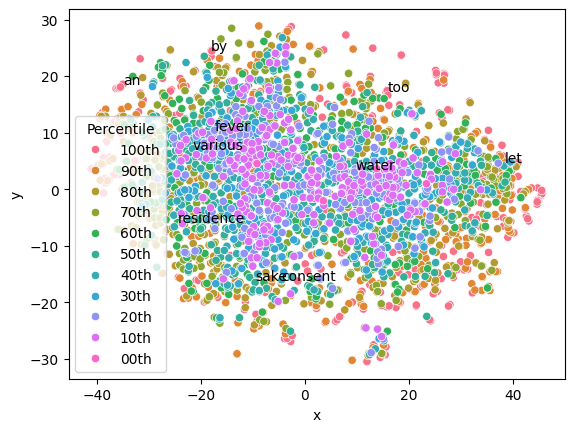
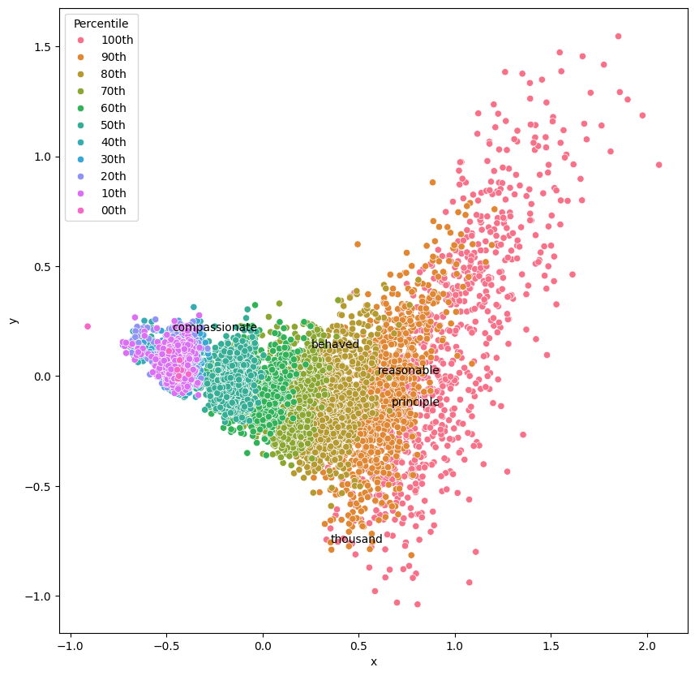
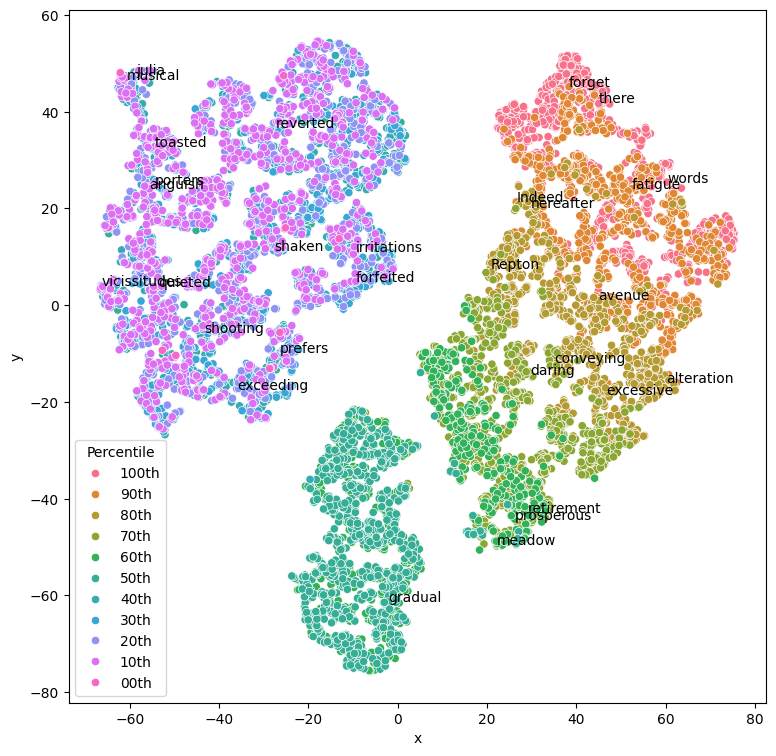
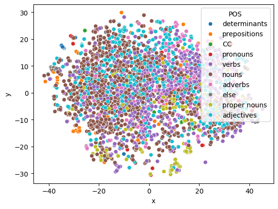
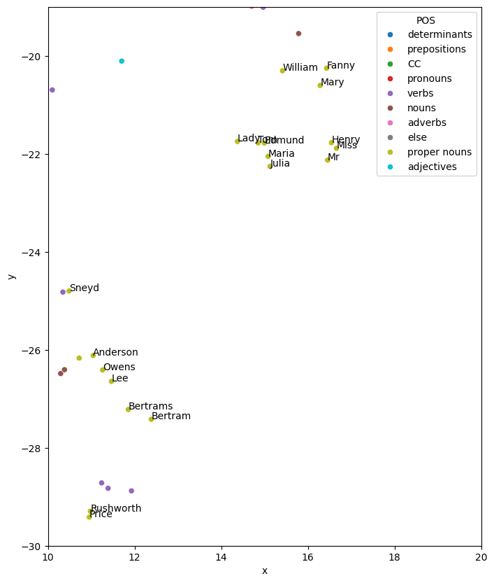

> The repository for this class can be found [here on GitHub](https://github.com/Oktogazh/NLP/tree/master/Lab_04).
# Exercise 4.1: load the dataset

The `random` module is imported in the import block in the top of the notebook.

```python
print("First recipe:")
print(data[0])

print("\n\nThree random recipes:")
random_recipes = random.sample(data, k=3)
for n, recipe in enumerate(random_recipes):
    print(f"\n== Recipe {n+1} ==")
    print(recipe)

"""
First recipe:
Brain Cakes.

When the head is cloven, take out the brains and clear them of strings,
beat them up with the yelks of two eggs, some crumbs of bread, pepper,
salt, fine parsley, a spoonful of cream, and a spoonful of flour; when
they are well mixed, drop them with a spoon into a frying-pan with a
little hot butter, and fry them of a light-brown color.


Three random recipes:

== Recipe 1 ==
Pork Stew Pie.

Take small bones and pieces of pork that will not do for sausage; roll
out some crust with but little shortening; lay in the meat and small
pieces of crust alternately; sprinkle in flour and seasoning, cover it
with water, and put on a crust.

== Recipe 2 ==
RASPBERRY ICE CREAM.

Is made according to the preceding receipt.

== Recipe 3 ==
To Brown Oysters in their own Juice.

Take a quart of large oysters, wash them in their own juice, drain and
dip them in the yelk of eggs; heat butter in a frying-pan, and after
seasoning them with pepper and salt, put them in separately; when they
are brown on both sides, draw them to one side of the pan; strain the
liquor, and put it in with a piece of butter and flour enough to
thicken it.
```

I find little to say about the output exept that they are fairly short and that the second one seem to rely on others recipes from the same textbook, which may cause problem in our analysis. Another potential problem seems to be the concervative writing system, like "receipt" instead of recipe, this could misslead our word embedding analysis.
# Exercise 4.2: Testing
As we can see here, the `data_clean` function removed casing differences and punctuation.

```python

print(len(data))
print(len(data_clean))

"""
1034
1034
"""

print(data[0].split()[0])
print(data_clean[0][0])

"""
Brain
brain
"""


print(data[-1].split()[-1])
print(data_clean[-1][-1])

"""
color.
color
"""
```
  
In my own test, I compared each token of the first recipe and output a simple before/after comparison for every different token:

```python
tokens = re.split(r'[ \n]+', data[0])
cleaned_tokens = data_clean[0]
diff = [
    f"before: \"{token}\" - after: \"{cleaned_tokens[n]}\""
    for n, token in enumerate(tokens)
    if token != cleaned_tokens[n]
]
print("\n".join(diff))

"""
before: "Brain" - after: "brain"
before: "Cakes." - after: "cakes"
before: "When" - after: "when"
before: "cloven," - after: "cloven"
before: "strings," - after: "strings"
before: "eggs," - after: "eggs"
before: "bread," - after: "bread"
before: "pepper," - after: "pepper"
before: "salt," - after: "salt"
before: "parsley," - after: "parsley"
before: "cream," - after: "cream"
before: "flour;" - after: "flour"
before: "mixed," - after: "mixed"
before: "frying-pan" - after: "fryingpan"
before: "butter," - after: "butter"
before: "light-brown" - after: "lightbrown"
before: "color." - after: "color"
"""
```

As we can see, tokenisation does not mean lemmatisation and the plurials are still preserved. However, the punctuations are all removed, including the hyphens between composed words like "frying-pan" or "light-brown", the standardisation process thus creates terms that do not exist in the English language. This may or may not be the result intended, depending on our NLP task and devised goals.

In a second test, I extended the previous idea of inspecting every modification across all the text and ended up discovering an issue with the `data_clean` function, in this modified version of the code, we can inspect the results for the ninth text:

```python
total_tokens = 0
modified_tokens = 0
for n, text in enumerate([data[8]]):
    print(text)
    print(data_clean[8])
    tokens = re.split(r'[\s\n.]+', text)
    cleaned_text = data_clean[8]
    total_tokens += len(tokens)
    modified_tokens += len([t for i, t in enumerate(tokens) if t != cleaned_text[i]])
    for i, token in enumerate(cleaned_text):
        if token != tokens[i]:
            print(token, tokens[i])

print(f'{modified_tokens*100/total_tokens:.2f}% of the tokens were modified')
```

output
```
RHUBARB JAM. Peel the rhubarb stalks and cut them into small square pieces. Then weigh them, and to each pound allow three quarters of a pound of powdered loaf-sugar. Put the sugar and the rhubarb into a large, deep, white pan, in alternate layers, the top layer to be of sugar—cover it, and let it stand all night. In the morning, put it into a preserving kettle, and boil it slowly till the whole is dissolved into a thick mass, stirring it frequently, and skimming it before every stirring. Put it warm into glass jars, and tie it up with brandy paper. ['rhubarb', 'jam', 'peel', 'the', 'rhubarb', 'stalks', 'and', 'cut', 'them', 'into', 'small', 'square', 'pieces', 'then', 'weigh', 'them', 'and', 'to', 'each', 'pound', 'allow', 'three', 'quarters', 'of', 'a', 'pound', 'of', 'powdered', 'loafsugar', 'put', 'the', 'sugar', 'and', 'the', 'rhubarb', 'into', 'a', 'large', 'deep', 'white', 'pan', 'in', 'alternate', 'layers', 'the', 'top', 'layer', 'to', 'be', 'of', 'it', 'and', 'let', 'it', 'stand', 'all', 'night', 'in', 'the', 'morning', 'put', 'it', 'into', 'a', 'preserving', 'kettle', 'and', 'boil', 'it', 'slowly', 'till', 'the', 'whole', 'is', 'dissolved', 'into', 'a', 'thick', 'mass', 'stirring', 'it', 'frequently', 'and', 'skimming', 'it', 'before', 'every', 'stirring', 'put', 'it', 'warm', 'into', 'glass', 'jars', 'and', 'tie', 'it', 'up', 'with', 'brandy', 'paper']

--------------------------------------------------------------------------- IndexError Traceback (most recent call last) Cell In[77], line 9 7 cleaned_text = data_clean[8] 8 total_tokens += len(tokens) ----> 9 modified_tokens += len([t for i, t in enumerate(tokens) if t != cleaned_text[i]]) 10 for i, token in enumerate(cleaned_text): 11 if token != tokens[i]: IndexError: list index out of range
```
As it turns out, "sugar—cover" is not a composed word. It is two normal words separated by a long dash, not a hyphen. I ended up having to modify the clean function to reflect this reality. Similar issues then happened with another text where a line started with two hyphens "--" intended as a separators, but the cleaner attached the first word of the line to the last of the previous one. Then the word "o’clock" was removed by the cleaner because the `’` character was not recognised as a punctuation... Then I noticed that the cleaner also removed numbers from the texts. I had a similar issue with the symbol for degrees: `°`. At the end, I modified both the `data_clean` function and my code to have a perfect match between the tokens indices:

```python

def clean_text(text):

    # Cleans the given text using regular expressions to split and lower-cased versions to create
    # a list of tokens for each text.
    # The function accepts a list of texts and returns a list of of lists of tokens

    # lower case
    tokens = re.split(r"[\s\n.]+", text.replace("—", " ").replace("’", ""))
    tokens = [t.lower() for t in tokens]

    # remove punctuation using regular expressions
    # this line of code locates the punctuation within the given text and compiles that punctuation into a single variable
    re_punc = re.compile('[%s]' % re.escape(string.punctuation))
    # this line of code substitutes the punctuation we just compiled with nothing ''
    tokens = [re_punc.sub('', token) for token in tokens]

    # only include tokens that aren't numbers
    tokens = [token for token in tokens if token.isalpha()]
    return tokens

data_clean = []
for x in data:
    data_clean.append(clean_text(x))


# ...

total_tokens = 0
modified_tokens = 0
for n, text in enumerate(data):
    tokens = [
        i
        for i in re.split(r"[\s\n.\d°]+", text.replace("—", " "))
	    # only ignore the punctuation when it is standing alone between spaces
	    # in order to still have statistically meaningful results
        if i.translate(str.maketrans("", "", string.punctuation)) != ""
    ]
    cleaned_text = data_clean[n]
    total_tokens += len(tokens)

    modified_tokens += len([t for i, t in enumerate(tokens) if t != cleaned_text[i]])

print(f'{modified_tokens*100/total_tokens:.2f}% of the tokens were modified')

# 17.11% of the tokens were modified
```

This extensive testing allowed me to both have a deeper understanding of the original function and to actually refine the code from the practical.

# 4.3-4 Testing the model

Here are the parameters I ended up having the best results with:

```python
model = Word2Vec(sentences=data_clean, window=3, min_count=4, epochs=7, vector_size=64, sg=0)
 ```

Most of these hyper-parameters are linked to the scarcity of the data available. Lowering the context windows, the minimum count and only improved the result. The workers did not matter at this point, as it takes less than a second to train with the default value. Lowering the vector size is actually a more appropriate solution to decrease the training time, the vocabulary being so small, we don't need long vectors anyway, it is common knowledge that the values for the vectors and tensors dimention sizes should be powers of two, 100 takes actually the same time as 128 to train, if not less, depending on the number of workers and optimisers in use. With a minimum count of 4, the vocabulary is only of 2001 words. Slightly increase the number of epochs also gave more interesting results, whereas around 10 epochs showed signs of overfitting. Of course, I had to switch off the skip-gram algorithm to get the best results. Overall, my configurations where contrained by the most critical aspect of the exercise, the small size of the training dataset. For more certainty on my results, I looked up closest word vectors to several words, the most relevant I found was the word type "eggs", and here is the list its the closest word vectors:

```python
[('whites', 0.9224163293838501),
 ('yolks', 0.920360267162323),
 ('beat', 0.8724638819694519),
 ('light', 0.8256978988647461),
 ('eight', 0.8185628056526184),
 ('seven', 0.7715914845466614),
 ('froth', 0.7707000970840454),
 ('beaten', 0.7426764965057373),
 ('six', 0.739244282245636),
 ('yelks', 0.734084963798523)]
```

On a side note, the line `model.predict_output_word([ "flour", "eggs", "cream"])` surprisingly returned the word "eggs" as its first result...

```python

[('beat', 0.080623776),
 ('stir', 0.0484501),
 ('beaten', 0.018422658),
 ('mix', 0.016935904),
 ('add', 0.016457062),
 ('gradually', 0.01601872),
 ('eggs', 0.013798384),
 ('yolks', 0.013330725),
 ('six', 0.01258764),
 ('whites', 0.009465078)]
 ```

For a more exhaustive overview of the results, refer to the full [notebook published on github](https://github.com/Oktogazh/NLP/blob/master/Lab_04/notebook.ipynb).

# 4.5 Validating the model

It was not so easy to find synonyms that would fit in the model. For instance, the words honney, millet, poridge were not present, which I found surprising as those were all known and used ingredients at the time. This underlines the scarsity of our dataset.
The four last examples, the one I added, did not dramatically offset the general trend outlined by the initial ones and it seems that the model does a decent job at recognising synonyms, if only it is  not recognising all words as synonyms, for this, one would also need to look for false positives. That is, look how similar are words that are not supposed to be similar and include these statistics in our validation results.

```c
,Model,Test Words,Cosine Similarity
0,word2vec.model,"('stir', 'whisk')",0.66465074
1,word2vec.model,"('cream', 'milk')",0.9253601
2,word2vec.model,"('cake', 'muffin')",0.540201
3,word2vec.model,"('jam', 'jelly')",0.8087435
4,word2vec.model,"('reserve', 'save')",0.95402753
5,word2vec.model,"('bake', 'cook')",0.6010543
6,word2vec.model,"('wine', 'vinegar')",0.8828826
7,word2vec.model,"('chop', 'dice')",0.7124587
8,word2vec.model,"('sugar', 'molasses')",0.7795906
9,word2vec.model,"('wheat', 'rice')",0.81702924
```

# 4.6 Word2Vec for Litterary Research

[This article](https://ceur-ws.org/Vol-1751/AICS_2016_paper_48.pdf) present one concrete possible aplication of embedding in the field of litterary analysis. In its core, the study trains a model on a corpus made of several novels written by three famous authors of from the nineteenth century with the aim to find how do the characters name, which are only tokens unique to a given text, are represented in a high dimentional vector space, either groupped by author, characteristics or book, if they group at all. The analysis is carried out using and comparing the effects of the two algorithm flavours of Word2Vec, the skip-gram and continuous bag-of-words strategies. In their data preparation, they also leverage NLTK's POS tagging to analyze the level of clustering of the different categories of words NLTK could tag. Doing so showed a better clustering effect using a smaller context window of two words and the CBOW algorithm working better with smaller minimum counts but the skip-gram algorithm taking over with higher minimum counts values. This preliminary work is used to inform the decision of which model to select for the task a hand, which in this case is the skip-gram model with a context window of two tokens, and a minimum count of five words.
When analyzed by their authors' corpus, the characters do cluster, but in different ways from author to author. When analizing all the texts together the paper gets two different results by using two different models. The model which clustered the most, unsurprizingly clustered all characters from different books and authors together. And the one that clustered the less for the same minimum count (50, because the size of the blended corpus now allows higher values) however clusters Austen's characters together and Dicken's and Doyle's characters in another cluster. This second result is interesting in the measure that, in this, the characters clusters emerging do not group syntactically but by grouping of authors, where at least Austen's characters stand out together. 

# 4.7 Finding the main characters of Austen Mansfield Park with Word2Vec
## Training the model
For this analysis, I choose Austen's Mansfield Park because it was the biggest book of this author, whose character stood out of the normal character cluste in the analysis above. I had the same sort of errors in the testing as mentioned in the section 3-4. One of the problem was for example the numerica values that where all deleted from the  `clean_text` function. The work around for this specific problem was to allow alphanumerical values to pass in the cleaned tokens. At the end, 18.63% of the tokens were found to have been edited, which is slightly more than with the recipes, this was somewhat surprising to me as I expected a literary work to be more standard and plain than a random set of recipes. But at least it is a coherent result. The complete code for this analysis can always be found [here](https://github.com/Oktogazh/NLP/blob/master/Lab_04/notebook_mansfield.ipynb). Later on, I had to use NLTK to preserve the uppercased proper nouns, and only normalise the other words. This had the the proportion of edited tokens drop to 15.07%, which indicates that this originally high value was due to the numerous names and other proper nouns that can be found in the novel.

I trained the model using the skip-gram aglorithm and selecting other parameters in light of the informations revealed by the paper, but still using 64 dimensions for the vector to help optimize training. To optimize the clustering effect I also chose a minimal count of 5, which limited the model to 2494 words, at the scale of this novel, this seems limited, but it's just another testimony of the Zipf law. After a rapid training, I tested that everything went well by looking the closest cosine values for the vector "fear":

```c
[('curiosity', 0.9676368236541748),
 ('unpleasant', 0.9673759341239929),
 ('mine', 0.9672518372535706),
 ('perceive', 0.9644420146942139),
 ('supply', 0.9641596078872681),
 ('deserved', 0.9620928168296814),
 ('justified', 0.960929811000824),
 ('willing', 0.9608338475227356),
 ('possibly', 0.9598881602287292),
 ('suspected', 0.9594955444335938)]
 ```
 
Surpisingly, the word curiosity comes first. But I don't think this is a problem from the model, but rather a feature coming from Austen's writing style...
I also trained a model with a minimal count of 1 for some of the plots in the next section.

## Using dimensionality reduction for ploting the vectors
### A look at the word's frequency

Now, we'l try to get some visualisation of the word-vectors. First we'll have a look on to which extent the frequency of a word in the training corpus has an influence on that vector representation. The goal was to reproduce the results from the paper, if there seems to indeed be an influence of the frequency on the vectors, the results are quite different, with the most common word (red-orange) being scattered around the periphery of the plot.



A second look on the paper informs us that their plot was initiated with Principal Component Analysis. We then retry the operation but using PCA for the dimensionality reduction and this second model we trained on litterally all the words found in the novel. This time, I could get results visualy closer to the ones in the paper, although not exactly the same shape.


As the paper spoke of initiating with PCA, I retried using first PCA to go from 64 dimensions to 3, and second TSNE to go from 3 to 2 dimensions. Here is the result:

```python
import seaborn as sns
import matplotlib.pyplot as plt
import pandas as pd
import numpy as np
from numpy import random
from sklearn.decomposition import PCA

word_vectors = model_low_min_count.wv
vocab = list(word_vectors.key_to_index)
X = word_vectors[vocab]

pca = PCA(n_components=3)
X_pca = pca.fit_transform(X)
X_embedded = TSNE(n_components=2, learning_rate="auto", perplexity=50).fit_transform(
    X_pca
)

plt.figure(figsize=(9, 9))

df = pd.DataFrame(X_embedded, columns=["x", "y"])
df["word"] = vocab
df["Percentile"] = [f"{10-(i//(len(vocab)//10))}0th" for i, pos in enumerate(vocab)]

# Plot using Seaborn
sns.scatterplot(x="x", y="y", data=df, hue="Percentile")

# Annotate random points with the words
for i in range(30):
    n = random.randint(len(vocab))
    plt.annotate(df["word"][n], (df["x"][n], df["y"][n]))

plt.show()
```


This is still different from the paper, but conceptually closer. Dimensionality reduction losses imformation by definition, and this information is optained using a stochastic process, and this is why it is fundamentally impossible to fully reproduce the result showed in the paper, let alone without access to the original code.
### Finding the main characters
For this plot, we used NLTK to tag the POS to which the token belong. One can see three main areas where green points cluster.


Let's inspect that one on the bottom center-right.
```python
df = pd.DataFrame(X_embedded, columns=["x", "y"])
df["word"] = vocab
dic = {
    "CC": "CC",
    "CD": "else",
    "DT": "determinants",
    "EX": "else",
    "FW": "proper nouns",
    "TO": "prepositions",
    "IN": "prepositions",
    "JJ": "adjectives",
    "JJR": "adjectives",
    "JJS": "adjectives",
    "MD": "else",
    "NN": "nouns",
    "NNPS": "nouns",
    "NNS": "nouns",
    "NNP": "proper nouns",
    "PDT": "pronouns",
    "PRP": "pronouns",
    "PRP$": "pronouns",
    "RB": "adverbs",
    "RBS": "adverbs",
    "RBR": "adverbs",
    "RP": "else",
    "VB": "verbs",
    "VBD": "verbs",
    "VBG": "verbs",
    "VBN": "verbs",
    "VBP": "verbs",
    "VBZ": "verbs",
    "WDT": "determinants",
    "WP": "else",
    "WRB": "else",
    "WP$": "else",
    "UH": "else",
}

df["POS"] = [dic[pos] for word, pos in nltk.pos_tag(vocab)]

sns.scatterplot(x="x", y="y", data=df, hue="POS")
plt.show()

plt.figure(figsize=(8, 10))
sns.scatterplot(x="x", y="y", data=df, hue="POS")
plt.xlim(10, 20)
plt.ylim(-30, -19)
for i in range(2400):
    if df["POS"][i] == "proper nouns":
        plt.annotate(df["word"][i], (df["x"][i], df["y"][i]))
plt.show()
```



Can you spot Fanny's dot? She's got so far from the rest of the Price family, exept for her brother William who would still come and see her from time to time! 