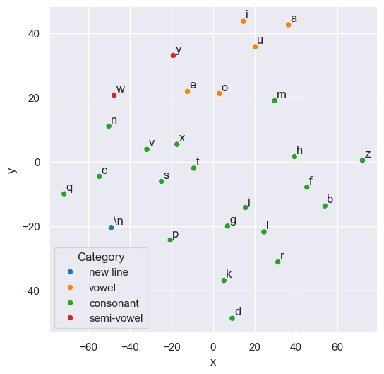
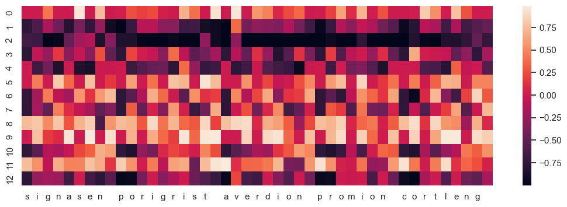
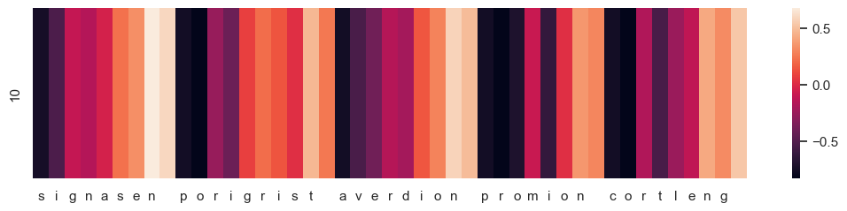
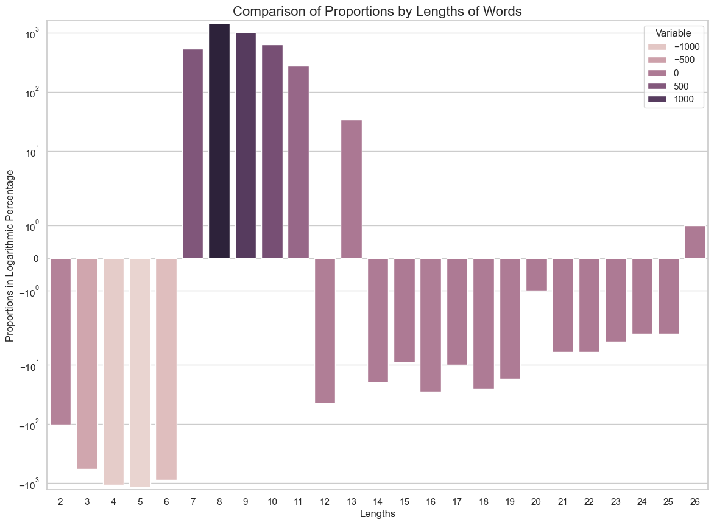
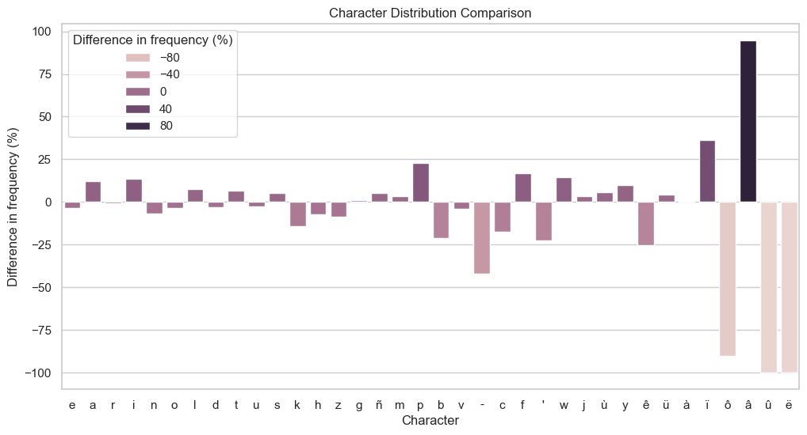
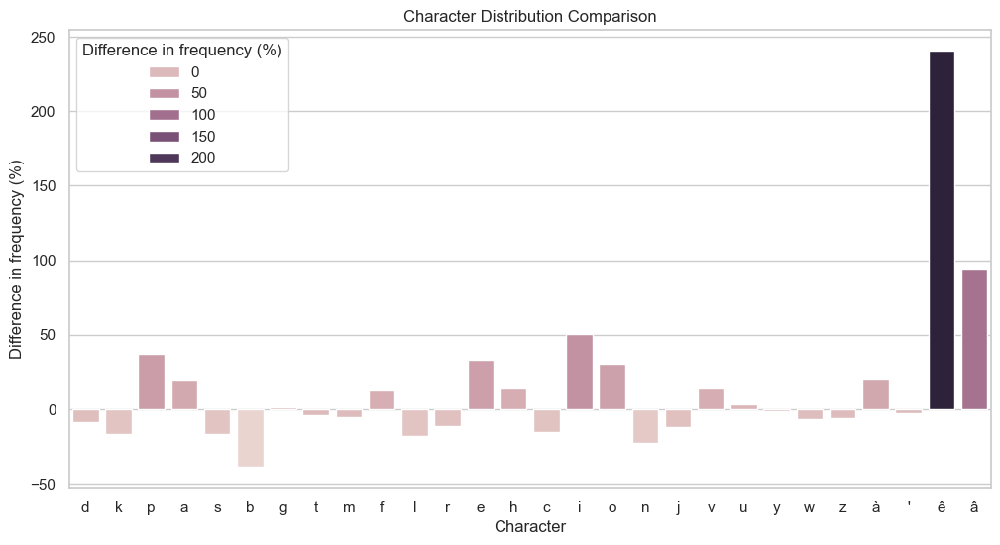

## Module ICE-4005-0: M.Sc. Generalist Mini-project 2024/25


# LSTM-based Pipeline to Generate Pseudo-Words


**Abstract**  
This work presents a new way to programmatically generate large sets of pseudo-words for psycholinguistic and applied linguistic large scale experiments. The method used is based on LSTM cells designed using PyTorch. Some ways to tests the validity and consistency of a large sample of pseudo words are also proposed.  
Overall, the experience conduced on a Breton pseudo-word generator seems conclusive, with the small exception of the really short words, two and three characters long that become under-represented due to a low availability of plausible combinations not already associated to a meaning. We finally offer ways to offset these problems as well as discussing the importance of the problem in regard of the experimental goal.  

**Content**
1. [Introduction](#introduction)
2. [Background](#background)
3. [Aims and Objectives](#aims-and-objectives)
4. [Methods Studied](#methods-studied)
5. [Data Collection](#data-collection)
6. [Training the Models and Generating Pseudo-Words](#training-the-models-and-generating-pseudo-words)
7. [Visualizations](#visualizations)
8. [Testing a Pseudo Dictionary](#testing-a-pseudo-dictionary)
	1. [The length of the words](#the-length-of-the-words)
	2. [General Characters Distribution](#general-characters-distribution)
	3. [Distribution of the First Characters](#distribution-of-the-first-characters)
9. [Limitations](#limitations)
10. [Discussions and Conclusion](#discussions-and-conclusion)
11. [References](#references)

# Introduction
This mini-project took many directions and shapes during the months, as can testify the logbook. Initially oriented towards a Welsh spellchecker, it became a planed mini vocabulary test, before settling on the question of generating large sets of pseudo-words for said vocabulary tests.  
One constant during the process was the note keeping in the digital logbook, which can be found on this web page: https://oktogazh.github.io/posts/ice-4005-dashboard. It keeps track of the progress made along the year. The final form the project took was a [Jupyter notebook](https://github.com/Oktogazh/sudogen) called "Sudogen" that anyone can clone and adapt to their need to create an arbitrary long list of pseudo-words for applications in applied linguistics and psycholinguistics. The repo is thought of as an introductory tutorial to PyTorch and deep learning in general. This inquiry eventually led the author to turn towards a deep-learning based solution and familiarize with different important libraries in the field, namely Keras and PyTorch.

# Background
This work finds its root on a wider interest on the questions and challenges of second language acquisition. In the context of Language Technologies, this interest leads naturally towards the question of language and vocabulary testing, as testing, and the metrics it provides is the only ways to caliber and reinforce a system able to filter the most relevant language learning content. Such metric does not exist yet, but studies suggest that vocabulary tests based on the ability to recognize real words from so-called pseudo-words be at the core of such testing framework. This is due to the simplicity and speed at which relevant scores can be obtained.  However, a big problem of these test is the capacity to scale these tests, due to the fact that so far, the pseudo-words used in psycholinguistic experiment have to be handcrafted, which requires both a lot of time and an advanced expertise on the language for which we want to create these pseudo-words. Scaling both vertically, large-scale in English, and horizontally, port the testing methodology to more languages, could be ease if it were possible to create high quality pseudo-words for any language by learning from a list of real words their orthographic and phonotactic rules programmatically, in order to later generated large quantity plausible words. This problem turned out to be less trivial than expected, and progressively became the topic of this generalist mini-project.

# Aims and Objectives
The goals for this project can be listed as follows:
1. Find an algorithm able to learn the rules specific to a language orthography and phonotactics.
2. Exploit the learned rules to generate arbitrarly long list of plausible words or pseudo-words.
3. Publish a pipeline to enable others to generate such list for as many languages as possible.
4. Produce visualizations to help these people understand what they do and test the results on a large sample of generated items.
5. Test a generated corpus of pseudo-words and discuss the results.

# Methods Studied
This section is a brief summary of the methods attempted to solve the problem at hand, and their strengths and weaknesses.
## Weighted or non-weighted HMM
The most common method used so far is to consider words as Hidden Markov Model (HMM) and to extract n-grams of characters from a matrix of n-grams for any given position of the words (where each column lists all the bigrams or trigrams starting at the index of the first dimension of the matrix). Then, attach together the n-grams that share characters at the same given index. This method is supported by the project [UniPseudo](http://www.lexique.org/shiny/unipseudo/) (New et al. 2023), written in R. An alternative version of this process would be to weight the bigrams or trigrams in order to follow the probabilities present in the lexis. This works reasonably well to build short list of pseudo-words for most languages, but the method has a range of issues. First, it is not possible to create plausible really short words, if the list of word is really long, a two or three characters long word could be deduced as being a real word based on logic only. Second, some language have what we call long distance relationship, like vowel harmony in Turkish, and this aspect cannot be preserved in a simple Markov model approach. 

## MAXENT Model
A paper by Hayes, B., Wilson, C. (2008) attracted my attention as the title seemed to mention the programmatic learning of phonotactic rules based on maximum entropy (MAXENT). But as it turned out, this technique cannot learn the rules on its own, but rather tests. So the modelization relies on both a corpus of words transcribed phonetically and rules formalized by hand, the model merely tests the validity and importance of the rules. This seems to go against the stated goals of maximizing the efficiency in producing pseudo-words with as little expertise as possible on the language. But MAXENT is build on important concept in information theory, and mathematics. By learning this model I familiarized myself with the concept of entropy and multi-variable derivative (used in Lagrangian multipliers which try to maximize the entropy in regard to a set of constrains). These concept allowed me to understand the basics of neural networks and deep learning which is the technological solution I ended up adopting.

## LSTM cells
Pytorche-powered long short-term memory cells are the solution I ended up retaining for modelizing the orthographic and phonotactic rules that make the lexis of a language. LSTM cells have this capacity to learn to modelize sequences based by learning what to forget of the previous context (hidden state) and memorizing the rest. I tried different combinations of hyperparameters for my model, trying to find a balance between minimalism and comprehensiveness, we want to learn a maximum of rules without learning the words themselves. For the Breton model exposed here, the model totaled a number of 144 550 trainable parameters, 9 embedding dimensions (for a "vocabulary" of 36 characters) and 190 embedding dimension for more than 62 000 words to be learned. This relates to a general trend in the modelization of phonotactic rules, the symbols are relatively simple to represent, but the complexity lies in the structure. 
# Data Collection
The [first part](https://github.com/Oktogazh/sudogen/blob/master/1%20Introduction.ipynb) of the project is dedicated to the constitution of corpora to train the models. Two complementary ways have been developed to gather sets of words for different languages. The first one, more versatile relies on a list of Hunspell dictionary maintained by Mozilla for the localization of their products available [here](https://mozilla-l10n.github.io/firefox-dictionaries/complete.html). It allows anyone to easily try to follow the tutorial along and generate sets of pseudo words for many languages. However, the Hunspell dictionaries are often limited. Some of them are poorly constituted and lack words or contain inflected words that should not be presented as entries, after all these are spellchecker dictionaries, not real dictionaries, and there goal is to ensure that no misspelling is being made, nothing more. For a curated list of lemmas, made by professional linguists, it is better to simply scrap the content of a dictionary, which is what we did in the second section of this part. We fetch and curate a list as complete as possible of all the available lemmas in the Breton diachronic dictionary "[Devri](https://devri.bzh/)", leaving the proper nouns such as holidays and toponyms to ensure that a semantic meaning is associated to each and every lemma. But even in the case where we fetch lemmas from a dictionary, which will be used as training and validation sets, we also load a Hunspell dictionary to have an additional layer of spellchecking in the generation phase, as we shall see in the next section.

# Training the Models and Generating Pseudo-Words
The [second part](https://github.com/Oktogazh/sudogen/blob/master/2%20Training.ipynb) of the project is to use the data collected previously to train a small language model. To speed up the process, the training set is grouped in a hundred arrays containing 1% of the shuffled dictionary entries each. These arrays are then joined together with a line break character, which symbolizes both a start tag and an end tag, as well as en end/start of the words. The hundred sets are divided into training (90%) and validation sets (10%). Different levels of loss can be obtained with similar hyperparameters, anything below 1.8 of cross-entropy is good for generating a small quantity of pseudo-words. But to get a consistent result vis-à-vis the original training set of more than 60 000 words, it is better to aim for below 1.7 or even 1.6, which can be really challenging. When the training is over we can use the model to generate arbitrary long sets of pseudo-words to manually assess the quality of the model before spending 10 to 15 minutes to generate a very long list of pseudo-words or keep training or trying new combinations of hyperparameters if unsatisfied with the results. Experience at training model teaches what to aim for during this early manual testing, like the number of words starting by some rare characters for a given number of pseudo-words or more simply, the "feeling" they give as plausible words.
When generating pseudo-words, we also ensure that none of the sequence generated is present in the training set, or susceptible to be recognized as real words by using the library [spylls](https://github.com/zverok/spylls), to exploit the Hunspell dictionary downloaded previously, we also capitalize the pseudo words during the spellchecking process to ensure that no proper nouns is generated; a lower cased month name may be interpreted as a spelling mistake by the library, but it is a real word but if the word is capitalized, the spell checker will look for both a proper noun and a lower cased word. In the case of the Breton pseudo-words, we noticed that the dictionary contained more entries than the Hunspell dictionary. This is why we also ensure that each generated pseudo-word is not in the lemmas list before adding it in the generated set.
When the model is deemed satisfying, it can be saved (or an old one can be loaded) and a large set of pseudo-words can be generated for further testing and analysis, as discussed in the following sections.

# Visualizations
[This part](https://github.com/Oktogazh/sudogen/blob/master/3%20Visualisations.ipynb) is inspired by the visualizations of then future co-founder of OpenAI, Andrej Karpathy blog post (2015) on the effectiveness of recurrent neural networks in the context of character-level language models. Before analyzing what happens in the model when it generates words, we start by doing some dimensionality reduction from the embedding layer that was trained on English words, with the aim of seeing the vowels and consonants clusterings.

As we can see, this visualization confirms that the model learned to group the vowels together as they can be exchanged for one another in an English word. Then, we start inspecting what happens inside the LSTM cell, during the word generation process. In the picture below, we can see a heat map of the values of the 13 indices of the hidden layer of a model generating fake words in English, the state of the vector changes after a new character is generated, the characters generated are shown in the bottom.



I initially thought this experiment was a failure that I could explain by either one of two reasons. The hidden state vector is too large and the representation of the memory is too distributed to be associated to a single index, or the same vector is too short, and the model does not learn the pattern recognition enough to attempt any analysis in the first place. But, as it turned out, I was using a python set to collect the newly generated words in my original function (so that a word would not be generated twice). This had as effect to output the words in the wrong order... I then turn the set to a list in the generator function and was able to identify patterns in my LSTM cell. In the heatmap above, we can see that the index 10 of the vector is actually displaying consistent behaviors with the line break (that I detokenized into spaces for convenience).

In the graph below, we drop the other indices to highlight only the one that seemed to measure the length of a word, or more precisely, the chances for a word to finish. In the second word below, the chances a word ends might go down if a new character (chosen in a stochastic process) or sequence of character is an unlikely end for a word; the second word had more chances to stop at "por" than at "pori" for instance.


By playing with the number of hyperparameters such as the `hidden_dim` or `embedding_dim` in the training, you might be able to identify an index that represent the likelihood of a vowel or a consonant being selected. In this model, with 13 dimension this aspect is too distributed in the vector, but with 8 dimensions, although I could show neurons associated with vowels, the words did not look as convincing. All in all, these visualizations help to understand the want an LSTM cell works and "remembers" things, but they are never a substitute for learning the math behind it.

# Testing a Pseudo Dictionary
The stated goal of the project being to generate a large set of pseudo-words, which we call here a pseudo dictionary, we'll show here a battery of tests administered to a pseudo Breton dictionary of the same length as the original dictionary the model was trained, that is 62 169 items. As the pseudo-words generated in this project are intended to be used in the context of psycholinguistic studies, we will now test a generated set to try to find out if there are aspects of the pseudo-words that may allow future test takers to spot them based on statistical heuristics. One interesting aspect about training the model on a full dictionary is that we get some fairly rare instances, and we can see, when generating an equally large set of words, how well was the training set "digested" by our model. For instance, our set of Breton lemmas only contains 31 items starting with the character "z" on out of a total of 62 172 items. That is 0.05% chances of having a word starting with a "z" or 1 chance for 2005 items. As we don't only want our model to learn the main traits of our lexis, but the entire diversity of what a "plausible" word in the language looks like, we want our model to be able to reproduce such outlier in similar proportions. One can only inspect this by producing an equally large set of pseudo-words as the original set of words before analyzing it.

## The length of the words
First, let's look at the average length difference between the two sets. As we can see below, the pseudo-words are in average a little longer than their real counterparts. Then we'll try to understand what part of the generated set differs from the original set by comparing the quantity of items for a given length.
```python
8.250639386189258 # real lemmas
8.480432369830623 # generated pseudo-lemmas
```
  
Here is the detailed distribution for each length of words.
```python
length      lemmas          pseudo-lemmas
0                0                      0
1                0                      0
2              109                      6
3              745                    174
4             2003                    942
5             4365                   3200
6             8089                   7209
7             9843                  10380
8            10369                  11832
9             9340                  10350
10            6839                   7476
11            4634                   4908
12            2750                   2706
13            1411                   1445
14             808                    788
15             378                    369
16             202                    174
17             105                     95
18              69                     44
19              45                     28
20              25                     24
21              15                      9
22               9                      3
23               8                      4
24               4                      1
25               3                      0
26               1                      2
```

And a graph to help visualize the gap between each length:

Here we see that the lengths of the generated words varies greatly from the training set. But the explanation is straightforward. The fact is that a large part of the plausible short words are "already taken" and even if the model initially generated the right amount of short words, it would not retain them in the final list because those words were real. This is the reason why the words of length 1 were taken out of the training set too, because only "lone vowels" can make such words, and only the letters "i" and "u" are not taken. But if the model did not learn well to reproduce the exact probabilities of short or long words, it still did what would be impossible for a gram-based HMCM. It can create two-characters-long words, although much fewer of them and very long words, more words of length 26 characters than there is in the training set. In previous tests, we even managed to generate words longer than anything present in the training set. This underscores once again the successful learning of patterns, but it also points out that the model is not that good to learn pure distributions.

Next, we'll look at the characters' distribution.
## General Characters Distribution

First, let's take a look at the distribution of characters regardless of their position in the words. Any model can produce words that look plausible, but the risk is to have all of them being "alike", by creating a "mean of the words in the dictionary" or the "most plausible words", if the temperature used to flatten the distribution of the softmax function (which shows the probabilities of the next character for all characters) were too low. Otherwise, if the temperature is too high, the probabilities painfully learnt by the model during training would be offset by a too strong randomization, and the generated words would be random garbage.


This plot is much more encouraging than the previous ones. The characters are ordered left to right from the most to the least frequent. As hoped for, there are a few variations, but as the characters become rarer, the variations become more important. Some low frequency characters display a higher frequency in the generated set. This may be explained by the fact that the characters in questions mostly appears within regular structures, like "à" which often occurs as a contraction to "war" ("àr" meaning on, upon) in the beginning of a word, think of English words like "onwards", "ongoing" etc... Conversely, the location of the hyphens seem to have confused the model to a point that it did not learn properly where to place it. Some characters were not generated at all, but their frequency in the training set is very low, 10 occurrences for "ô" and 3 and less for "â", "û" and "ë" for the entire set. The higher frequency of some rare characters in the generated set indicates a propensity of the model to learn the structures rather than pure probabilities, which is encouraging.

Finally, we'll look at the frequencies of the first characters.
## Distribution of the First Characters

Psycholinguists teach us that the beginning of a word is fundamental in the recognition of a word, more so than the way they end. This is why we inspect the distributions of the first characters here.


As we can see, most items oscillate within a range of more or less 50% in regard to the original set, often less than 25% and an average of 13.84%. Only the two least common first letters are being over-represented, which together with the underrepresentation of the two most common first characters may indicate that a slightly too high temperature was used for this particular model.

But the most important thing, that validates the quality of this model, is the fact that all 28 characters starting pseudo lemmas are the same as those found in the original dictionary. There are 36 characters identified in the previous graph, and if the model had generated a word starting with "ñ" or "-" it would have indicated a poor training.

# Limitations
The results presented here are the fruits of a long succession of trials and errors. A low cross entropy in the loss function is not purely dependent on the hyperparameters, nor does it guaranty qualitative results.
Generating pseudo-words will always necessitate some language-specific linguistic expertise. But hopefully, this experiment shows how accessible neural networks-based techniques can be despite limited programming skills. Overall, the biggest pitfall to the methodology explored here is linked to the nature of languages themselves. Most small plausible small words are already taken, and thus difficult to generate. More sophisticated filters can be added to the generators to try to obtain better results to the tests presented above. But the main question is, would such optimization worth the effort? At the end of the day, when intending to test vocabulary for an entire lexis of more than 50 000 items, what are the chances to encounter shorter words? And even if this were to occur, the question remains whether this encountering would influence the results in any meaningful way. The risk here is more that of "over-optimization", because the nature of the usage of sets that large allows for a margin of imperfection.

# Discussions and Conclusion
In this experience, we demonstrated the viability of using RNN to generate large sets of language-specific pseudo-words. We also highlighted the limitations regarding the possibility of creating plausible very short words, regardless of the method used, because of the lack of available combination, a problem likely to be present in many languages.  
On the other hand, the gain in productivity allowed by neural networks opens new prospects. In the case of pseudo-words, it opens the door to large scale experiments, where the qualitative aspect of the items becomes less relevant. This quantity over quality paradigm is also not so accurate because, for as long as there are enough available items to use and to compare together, one can always develop new methods to select the qualitative part from this set. In other words, the abundance offered by generative AI presents a new paradigm in which quality emerges from quantity. That is, if the proper tooling is developed in parallel to these large samples to filter this qualitative part of the generated data.
# References
- Brownlee, J.,  n.d. Deep Learning For Natural Language Processing. MachineLearningMastery.com. URL [https://www.machinelearningmastery.com/deep-learning-for-nlp/](https://www.machinelearningmastery.com/deep-learning-for-nlp/) (accessed 1.27.25).
- Chomsky, N., Halle, M., (1968) The Sound Pattern of English. The MIT Press.
- Coleman, J., Pierrehumbert, J., n.d. Stochastic phonological grammars and acceptability.
- Cover, T.M., Thomas, J.A., 1991. Elements of Information Theory, 99th ed. edition. ed. Wiley–Blackwell, Hoboken, NJ.
- Goldsmith, J., Xanthos, A., 2009. Learning Phonological Categories. lan 85, 4–38. [https://doi.org/10.1353/lan.0.0100](https://doi.org/10.1353/lan.0.0100)
- Hayes, B., Wilson, C., 2008. A Maximum Entropy Model of Phonotactics and Phonotactic Learning. Linguistic Inquiry 39, 379–440. [https://doi.org/10.1162/ling.2008.39.3.379](https://doi.org/10.1162/ling.2008.39.3.379)
- Jaynes, E.T., 2003. Probability Theory: The Logic of Science, Annotated edition. ed. Cambridge University Press, Cambridge, UK ; New York, NY.
- Jaynes, E.T., 1983. E.T. Jaynes: Papers on Probability, Statistics and Statistical Physics: 158, 1989th edition. ed. Kluwer Academic Publishers, Dordrecht.
- Karpathy, Andrej, 2015 The Unreasonable Effectiveness of Recurrent Neural Networks [WWW Document], n.d. URL [https://karpathy.github.io/2015/05/21/rnn-effectiveness/](https://karpathy.github.io/2015/05/21/rnn-effectiveness/) (accessed 5.18.25).
- Meara, P., 2012. Imaginary Words, in: The Encyclopedia of Applied Linguistics. John Wiley & Sons, Ltd. [https://doi.org/10.1002/9781405198431.wbeal0524](https://doi.org/10.1002/9781405198431.wbeal0524)
- New, B., Bourgin, J., Barra, J., Pallier, C., 2023. UniPseudo: A universal pseudoword generator. Quarterly Journal of Experimental Psychology 30. [https://doi.org/10.1177/17470218231164373](https://doi.org/10.1177/17470218231164373)