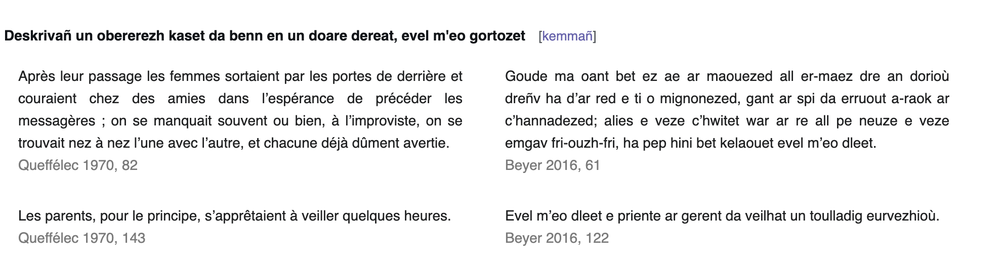

# 1 Extracting the corpus from a wiki
## 1.1 Presentation of the wiki
For this practical, I decided to source the sentences in a wikimedia instance doing comparative stylistic between Breton and French: [Style](https://style.miraheze.org/wiki/Taolenn_an_danvezio%C3%B9). Conveniently, the wiki contains a category of pages named "Korpus fr-br", which is used to mark all the examples of translation analyzed in the wiki in a standard way using wikitext templates (here the template name is "Person" (reference to the book and its translation) and get passed several variables that we're going to extract later):
```
{{person
|fr=Après leur passage les femmes sortaient par les portes de derrière et couraient chez des amies dans l’espérance de précéder les messagères ; on se manquait souvent ou bien, à l’improviste, on se trouvait nez à nez l’une avec l’autre, et chacune déjà dûment avertie.
|pajenn-fr=82
|br=Goude ma oant bet ez ae ar maouezed all er-maez dre an dorioù dreñv ha d’ar red e ti o mignonezed, gant ar spi da erruout a-raok ar c’hannadezed; alies e veze c’hwitet war ar re all pe neuze e veze emgav fri-ouzh-fri, ha pep hini bet kelaouet evel m’eo dleet.
|pajenn-br=61}}
```
![[../assets/style_example.png]]
Conveniently transcluded in the other articles like this:
```
==== Deskrivañ un obererezh kaset da benn en un doare dereat, evel m'eo gortozet ====

{{:Alies e veze c’hwitet war ar re all}}

{{:Evel m’eo dleet e priente ar gerent da veilhat un toulladig eurvezhioù}}
```
Which shows like this in [a normal article](https://style.miraheze.org/wiki/Verbo%C3%B9_ha_stummo%C3%B9_damskoazella%C3%B1_e_brezhoneg#Deskriva%C3%B1_un_obererezh_kaset_da_benn_en_un_doare_dereat,_evel_m'eo_gortozet):


## 1.2 Extracting the corpus
The French-Breton corpus is accessible [here](https://style.miraheze.org/wiki/Rummad:Korpus_fr-br). 

From this category page we can access all the examples used in the wiki. Then, we load them in a json file to analyse these examples later. You can find the code used for the extraction as well as the extracted corpus [here on my GitHub](https://github.com/Oktogazh/NLP/tree/master/Tech%20Iaith).

# 2 Analyzing a sentence

Here is a graph of the dependencies in one of the French sentences of the corpus. I could not analyze a Breton sentence as precisely because 
<svg xmlns="http://www.w3.org/2000/svg" xmlns:xlink="http://www.w3.org/1999/xlink" xml:lang="fr" id="a123f7c54c11436bb45c902fa92cb98d-0" class="displacy" width="1625" height="399.5" direction="ltr" style="max-width: none; height: 399.5px; color: #000000; background: #ffffff; font-family: Arial; direction: ltr"> <text class="displacy-token" fill="currentColor" text-anchor="middle" y="309.5"> <tspan class="displacy-word" fill="currentColor" x="50">Les</tspan> <tspan class="displacy-tag" dy="2em" fill="currentColor" x="50">DET</tspan> </text> <text class="displacy-token" fill="currentColor" text-anchor="middle" y="309.5"> <tspan class="displacy-word" fill="currentColor" x="225">animaux,</tspan> <tspan class="displacy-tag" dy="2em" fill="currentColor" x="225">NOUN</tspan> </text> <text class="displacy-token" fill="currentColor" text-anchor="middle" y="309.5"> <tspan class="displacy-word" fill="currentColor" x="400">derrière</tspan> <tspan class="displacy-tag" dy="2em" fill="currentColor" x="400">ADP</tspan> </text> <text class="displacy-token" fill="currentColor" text-anchor="middle" y="309.5"> <tspan class="displacy-word" fill="currentColor" x="575">la</tspan> <tspan class="displacy-tag" dy="2em" fill="currentColor" x="575">DET</tspan> </text> <text class="displacy-token" fill="currentColor" text-anchor="middle" y="309.5"> <tspan class="displacy-word" fill="currentColor" x="750">cloison,</tspan> <tspan class="displacy-tag" dy="2em" fill="currentColor" x="750">NOUN</tspan> </text> <text class="displacy-token" fill="currentColor" text-anchor="middle" y="309.5"> <tspan class="displacy-word" fill="currentColor" x="925">qui</tspan> <tspan class="displacy-tag" dy="2em" fill="currentColor" x="925">PRON</tspan> </text> <text class="displacy-token" fill="currentColor" text-anchor="middle" y="309.5"> <tspan class="displacy-word" fill="currentColor" x="1100">réchauffent</tspan> <tspan class="displacy-tag" dy="2em" fill="currentColor" x="1100">VERB</tspan> </text> <text class="displacy-token" fill="currentColor" text-anchor="middle" y="309.5"> <tspan class="displacy-word" fill="currentColor" x="1275">les</tspan> <tspan class="displacy-tag" dy="2em" fill="currentColor" x="1275">DET</tspan> </text> <text class="displacy-token" fill="currentColor" text-anchor="middle" y="309.5"> <tspan class="displacy-word" fill="currentColor" x="1450">maîtres;</tspan> <tspan class="displacy-tag" dy="2em" fill="currentColor" x="1450">NOUN</tspan> </text> <g class="displacy-arrow"> <path class="displacy-arc" id="arrow-a123f7c54c11436bb45c902fa92cb98d-0-0" stroke-width="2px" d="M70,264.5 C70,177.0 215.0,177.0 215.0,264.5" fill="none" stroke="currentColor"/> <text dy="1.25em" style="font-size: 0.8em; letter-spacing: 1px"> <textPath xlink:href="[#arrow-a123f7c54c11436bb45c902fa92cb98d-0-0](view-source:http://0.0.0.0:5001/#arrow-a123f7c54c11436bb45c902fa92cb98d-0-0)" class="displacy-label" startOffset="50%" side="left" fill="currentColor" text-anchor="middle">det</textPath> </text> <path class="displacy-arrowhead" d="M70,266.5 L62,254.5 78,254.5" fill="currentColor"/> </g> <g class="displacy-arrow"> <path class="displacy-arc" id="arrow-a123f7c54c11436bb45c902fa92cb98d-0-1" stroke-width="2px" d="M420,264.5 C420,89.5 745.0,89.5 745.0,264.5" fill="none" stroke="currentColor"/> <text dy="1.25em" style="font-size: 0.8em; letter-spacing: 1px"> <textPath xlink:href="[#arrow-a123f7c54c11436bb45c902fa92cb98d-0-1](view-source:http://0.0.0.0:5001/#arrow-a123f7c54c11436bb45c902fa92cb98d-0-1)" class="displacy-label" startOffset="50%" side="left" fill="currentColor" text-anchor="middle">case</textPath> </text> <path class="displacy-arrowhead" d="M420,266.5 L412,254.5 428,254.5" fill="currentColor"/> </g> <g class="displacy-arrow"> <path class="displacy-arc" id="arrow-a123f7c54c11436bb45c902fa92cb98d-0-2" stroke-width="2px" d="M595,264.5 C595,177.0 740.0,177.0 740.0,264.5" fill="none" stroke="currentColor"/> <text dy="1.25em" style="font-size: 0.8em; letter-spacing: 1px"> <textPath xlink:href="[#arrow-a123f7c54c11436bb45c902fa92cb98d-0-2](view-source:http://0.0.0.0:5001/#arrow-a123f7c54c11436bb45c902fa92cb98d-0-2)" class="displacy-label" startOffset="50%" side="left" fill="currentColor" text-anchor="middle">det</textPath> </text> <path class="displacy-arrowhead" d="M595,266.5 L587,254.5 603,254.5" fill="currentColor"/> </g> <g class="displacy-arrow"> <path class="displacy-arc" id="arrow-a123f7c54c11436bb45c902fa92cb98d-0-3" stroke-width="2px" d="M245,264.5 C245,2.0 750.0,2.0 750.0,264.5" fill="none" stroke="currentColor"/> <text dy="1.25em" style="font-size: 0.8em; letter-spacing: 1px"> <textPath xlink:href="[#arrow-a123f7c54c11436bb45c902fa92cb98d-0-3](view-source:http://0.0.0.0:5001/#arrow-a123f7c54c11436bb45c902fa92cb98d-0-3)" class="displacy-label" startOffset="50%" side="left" fill="currentColor" text-anchor="middle">nmod</textPath> </text> <path class="displacy-arrowhead" d="M750.0,266.5 L758.0,254.5 742.0,254.5" fill="currentColor"/> </g> <g class="displacy-arrow"> <path class="displacy-arc" id="arrow-a123f7c54c11436bb45c902fa92cb98d-0-4" stroke-width="2px" d="M945,264.5 C945,177.0 1090.0,177.0 1090.0,264.5" fill="none" stroke="currentColor"/> <text dy="1.25em" style="font-size: 0.8em; letter-spacing: 1px"> <textPath xlink:href="[#arrow-a123f7c54c11436bb45c902fa92cb98d-0-4](view-source:http://0.0.0.0:5001/#arrow-a123f7c54c11436bb45c902fa92cb98d-0-4)" class="displacy-label" startOffset="50%" side="left" fill="currentColor" text-anchor="middle">nsubj</textPath> </text> <path class="displacy-arrowhead" d="M945,266.5 L937,254.5 953,254.5" fill="currentColor"/> </g> <g class="displacy-arrow"> <path class="displacy-arc" id="arrow-a123f7c54c11436bb45c902fa92cb98d-0-5" stroke-width="2px" d="M770,264.5 C770,89.5 1095.0,89.5 1095.0,264.5" fill="none" stroke="currentColor"/> <text dy="1.25em" style="font-size: 0.8em; letter-spacing: 1px"> <textPath xlink:href="[#arrow-a123f7c54c11436bb45c902fa92cb98d-0-5](view-source:http://0.0.0.0:5001/#arrow-a123f7c54c11436bb45c902fa92cb98d-0-5)" class="displacy-label" startOffset="50%" side="left" fill="currentColor" text-anchor="middle">acl:relcl</textPath> </text> <path class="displacy-arrowhead" d="M1095.0,266.5 L1103.0,254.5 1087.0,254.5" fill="currentColor"/> </g> <g class="displacy-arrow"> <path class="displacy-arc" id="arrow-a123f7c54c11436bb45c902fa92cb98d-0-6" stroke-width="2px" d="M1295,264.5 C1295,177.0 1440.0,177.0 1440.0,264.5" fill="none" stroke="currentColor"/> <text dy="1.25em" style="font-size: 0.8em; letter-spacing: 1px"> <textPath xlink:href="[#arrow-a123f7c54c11436bb45c902fa92cb98d-0-6](view-source:http://0.0.0.0:5001/#arrow-a123f7c54c11436bb45c902fa92cb98d-0-6)" class="displacy-label" startOffset="50%" side="left" fill="currentColor" text-anchor="middle">det</textPath> </text> <path class="displacy-arrowhead" d="M1295,266.5 L1287,254.5 1303,254.5" fill="currentColor"/> </g> <g class="displacy-arrow"> <path class="displacy-arc" id="arrow-a123f7c54c11436bb45c902fa92cb98d-0-7" stroke-width="2px" d="M1120,264.5 C1120,89.5 1445.0,89.5 1445.0,264.5" fill="none" stroke="currentColor"/> <text dy="1.25em" style="font-size: 0.8em; letter-spacing: 1px"> <textPath xlink:href="[#arrow-a123f7c54c11436bb45c902fa92cb98d-0-7](view-source:http://0.0.0.0:5001/#arrow-a123f7c54c11436bb45c902fa92cb98d-0-7)" class="displacy-label" startOffset="50%" side="left" fill="currentColor" text-anchor="middle">obj</textPath> </text> <path class="displacy-arrowhead" d="M1445.0,266.5 L1453.0,254.5 1437.0,254.5" fill="currentColor"/> </g> </svg>
Here is the same sentence analized as a list of token, parts of speech (POS), and stops:
```python
Les DET True
animaux NOUN False
, PUNCT False
derrière ADP True
la DET True
cloison NOUN False
, PUNCT False
qui PRON True
réchauffent VERB False
les DET True
maîtres NOUN False
; PUNCT False
```

# 3 Counting the tokens

```
50 most common alphabetic tokens:
In the French examples:
[('prêtre', 17), ('Dieu', 16), ('île', 15), ('Thomas', 12), ('homme', 10), ('mer', 10), ('devoir', 9), ('falloir', 8), ('contre', 8), ('femme', 7), ('îlien', 7), ('ciel', 7), ('rien', 7), ('bel', 6), ('faire', 6), ('ile', 6), ('paroisse', 6), ('nuit', 6), ('église', 6), ('tandis', 5), ('bien', 5), ('temps', 5), ('main', 5), ('avoir', 5), ('chrétien', 5), ('haute', 5), ('prière', 5), ('entendre', 5), ('année', 4), ('oeil', 4), ('recteur', 4), ('pêcheur', 4), ('petit', 4), ('fenêtre', 4), ('vent', 4), ('long', 4), ('posséder', 4), ('chose', 4), ('être', 4), ('bon', 4), ('prendre', 4), ('épave', 4), ('voix', 4), ('grève', 4), ('rendre', 4), ('lieu', 4), ('récif', 4), ('pauvre', 4), ('envoyer', 4), ('tête', 4)]

In the Breton examples:
[('gant', 43), ('enez', 20), ('ouzh', 20), ('evit', 15), ('evel', 14), ("d'ar", 13), ('beleg', 13), ('doue', 12), ('tomaz', 12), ('veze', 11), ('dezhañ', 11), ('vefe', 11), ('neuze', 9), ('bezañ', 9), ('oant', 8), ('holl', 8), ('reas', 8), ('dleet', 7), ("d'an", 7), ('mont', 7), ('enezourien', 6), ('gwelet', 6), ('daoust', 6), ('oabl', 6), ('goude', 5), ('maouezed', 5), ('lakaet', 5), ('gantañ', 5), ('iliz', 5), ('unan', 5), ('peñse', 5), ('vont', 5), ('sevel', 5), ('anezhañ', 5), ('daou', 4), ('a-raok', 4), ('person', 4), ('nemet', 4), ('lakaat', 4), ('dezho', 4), ('douar', 4), ('anezho', 4), ('heul', 4), ("c'helle", 4), ('diouzh', 4), ('penn', 4), ('aotrou', 4), ('klevet', 4), ('gellet', 3), ('betek', 3)]
```

Surprizingly, the word for "God" appears 16 times in French and only 12 times in Breton, but the word for "island" is much more present in Breton than in French. This might be because of the mutations and other sorts of inflections found in Breton, might have the counter ending up counting different forms of the same words separately. Which does not show up when selecting the most frequent words.

I don't want to elaborate more on the nature of the difference between types and token, the Zipft law and the Heap law, you can always read what I said in a previous assignment [here](nlp-lab-1).

# 4 Words Cloud
I used the 50 most common Breton words above to generate the following word cloud.

