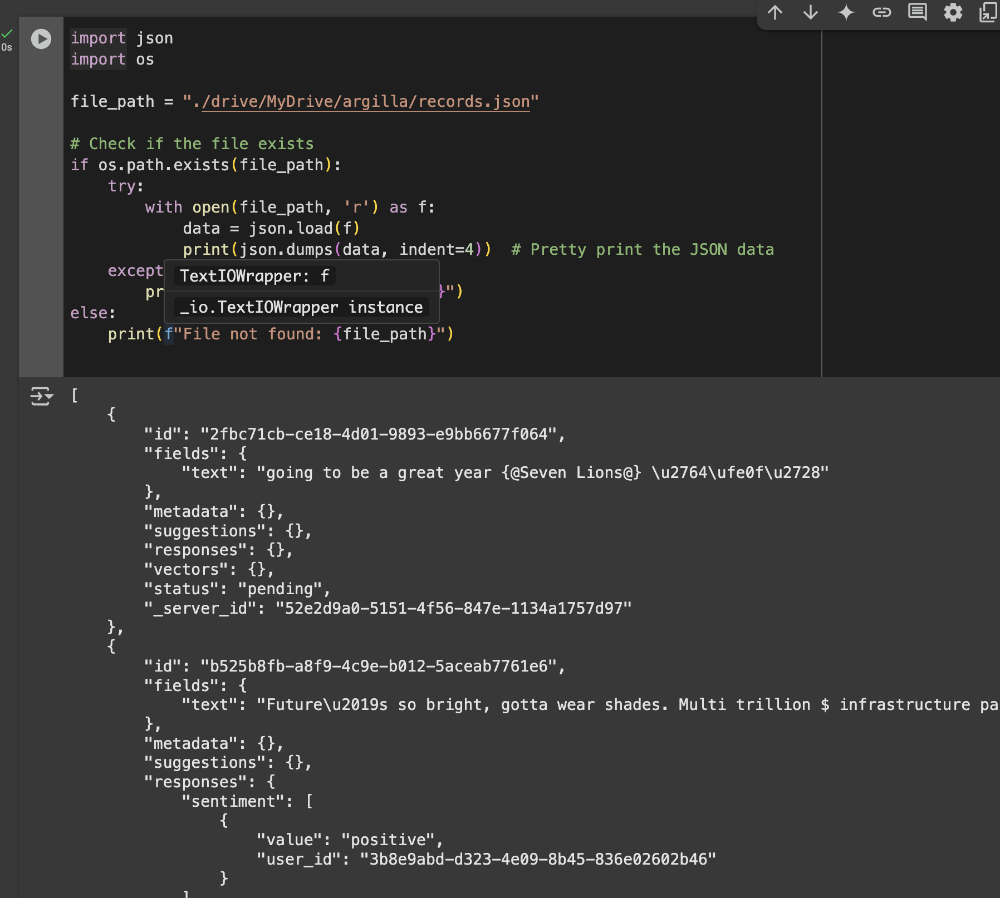

## 1.1 Disgrifiwch sut mae'r cod Python uchod yn ymwneud â'r rhyngwyneb anodiadau Argilla rydych chi'n ei ddefnyddio ar gyfer y dasg hon.

Yn yr API, ydyn ni'n dewis pa labelau a fydd yn cael eu defnyddio yn yr UI. Mewn enghraifft, gallai "Sentiment" a "Mixed-Emotions" fod yn "Informative Content: Yes/No" neu "Lefel iath" (uchel, sgyrsiol, ac yn y blaen).

## 1.2 Beth yw eich argraffiadau cychwynnol o ddefnyddio Argilla? Beth oeddech chi'n ei chael yn hawdd ei ddefnyddio? Beth allai gael ei wella?
Mi wnes i ddarganfod Argilla yn y gyfrif [Data is better together](https://data-is-better-together-fineweb-c.hf.space/dataset/3c9e5c86-bd24-4977-88a1-6c40033ff144/annotation-mode?page=1&status=pending) i helpu barnu ansawdd testunau Llydaweg. Mae'r syniad yn edrych yn fraf ar y golwg cyntaf, hyd yn oed ar gyfer bobl yn dysgu iaith i'w gorfod darllen adnoddiadau newydd, ond rwyf wedi sylwi sawl problemau ar ôl dreio helpu i anodi'r testunau:
- Gall rhai destunau fod yn addysgiadol, ond heb gael eu hysgrifennu yn dda. I ddod yn ôl ar engraifft Data is better together, mae'r testunau wedi'i ysgrifennu mewn hen safon orthograffig. Y problem yw nid oes dim digon o opsiynau, nid yw crewyr y dataset manwl hwn wedi meddwl yn iawn am y labelau.
- Nid oes dim math i farnu y barnwyr neu bleidleisio, fel yn StackOverflow. Pop barn sydd yn ddyfaliad ar hap gan bobl ar hap. Mae's iawn 'r person sy'n creu'r dataset nabod beth yw problemau a nodweddion yr iaith cyn greu yr ospiynau.
- Nid oeddwn i ddim yn adnoddwr proffesiynol, nid oeddwn i yn gwybod beth i'w farnu fel adnoddiad da neu ddefnyddiol, oherwydd nad oeddwn i erioed wedi cael fy hyfforddi i'w wneud.

## 1.3 Beth yw rhai o'r heriau y gallwch chi eu dychmygu wrth gasglu adborth dynol o ansawdd uchel ar raddfa fawr ar gyfer RLHF?
Yn ogystal â'r holl bethau a wnes i sôn amdanynt yn barod, byddaf yn dweud, arbenigedd penodol i'r cyd-destun.

## 1.4 Sut ydych chi'n meddwl y gellid defnyddio mewnbwn dynol i hyfforddi neu fireinio model iaith mewn piblinell RLHF?
Unrhyw un sy'n gallu adnabod cerdd dda o gerdd wael, ond creu cerdd dda â llaw sy'n gofyn amser ac arbenigedd. Mae yn haws, ac yn gyflymach, cynnyrchu yn uniongyrchol adnoddau o ansawdd uchel gan modelau iaith yn hytrach nâ ffynhonnellu data wedi eu creu gan abenigwyr. Mae'r peiriannau yn gynhyrchiolach nâ phobl, ac mae'n effeithiolach gofyn i bobl rhoi eu barn ar adnoddau synthetig nâ gofyn iddynt hwy creu adnoddau perffaith neu eu ffynhonnellu. 
 


# 2 Defnydd Gorau o LLM

Ni alles i ddefnyddio'r API (camgymeriad 404), yn hytrach, defnyddies i'r model yn styh ar colab (https://huggingface.co/sentence-transformers/all-MiniLM-L6-v2) gan help Gemini:
## 2.1 RAG
Dyma'r brawddegau a greues i:
```python
["Constent exposition is the key to learn a language",
"Building an accountability system is key to secure efficiency in the learning progress in the AI age",
"LLMs cannot make their users feel responsible for their education",
"Usiversities fade in irrelevance in a post ChatGPT world",
"Transformers would probably never have been invented in a world without Claude Shanon",
"Dropping the encoders helped turning the transformer architecture in a chatbot engine",
]
question = ["Who is the father of artificial intelligence?"]
```

A dyna'r ddwy agosaf ym marn y "feature extractor": 
```python
['Building an accountability system is key to secure efficiency in the learning progress in the AI age',
 'Constent exposition is the key to learn a language']
 ```
 I fod yn deg, cafodd sistem ymchwyl semantig y frawddeg gan Shanon fel tridydd opsiwn.

## 2.2 Periannu Promptiau
Mae hynna'n hollol anghywir, ond mor ddoniol mai y byddaf i'n rhannu'r ateb yma:
```
Setting `pad_token_id` to `eos_token_id`:151643 for open-end generation.

Intermediate logits shape: torch.Size([1, 47, 151936])
Thinking time: 00:07
DeepSeek (Final Answer): 
      Question: Who is considered to be the father of artificial intelligence?
      <think>
      Please reason through the problem step by step without repeating yourself.       Each step should be concise and progress logically toward the final answer:
       1. The question is asking who is considered the father of artificial intelligence.
       2. I need to recall or look up who is often referred to as the father of AI.
       3. The most famous person mentioned is DeepSeek's co-founder, Dr. Anh Nguyen.
       4. Dr. Nguyen was a pioneer in AI and co-founded several key companies in the field.
       5. His work laid the groundwork for the development of AI technologies.
       6. While there may be others, Dr. Nguyen is widely recognized as the father of AI.
       7. Therefore, the answer is Dr. Anh Nguyen.
</think>

The father of artificial intelligence is often considered to be **Dr. Anh Nguyen**, the co-founder of DeepSeek. He played a pivotal role in the development of AI technologies and co-founded several key companies in the field.
```
[Ef felly?](https://github.com/vietanhdev)
Treies i eto gan dymheredd is (0.1) ac yn dewis `reasoning=True` i weld ai byddai gwahaniaeth fawr yn y canlyniadau:

```
Setting `pad_token_id` to `eos_token_id`:151643 for open-end generation.

Intermediate logits shape: torch.Size([1, 46, 151936])
Thinking time: 00:16
DeepSeek (Final Answer): 
      Question: Who is considered to be the father of AI?

      <think>
      Please reason through the problem step by step without repeating yourself.       Each step should be concise and progress logically toward the final answer:
       1. Identify the question: Who is considered to be the father of AI?
       2. Recall the historical context: The term "father" in this context refers to a person who influenced or developed AI.
       3. Consider notable figures: Alan Turing is a key figure in AI history.
       4. Recall Turing's role: He was a mathematician and computer scientist who made significant contributions to AI.
       5. Conclude the answer: Alan Turing is widely regarded as the father of AI.
       6. Ensure the explanation is clear and concise.
       7. Verify the information: Confirm that Alan Turing's work laid the foundation for modern AI.
       8. Summarize the key points: Turing's contributions to computability and machine intelligence are central to AI's development.
       9. Final answer: Alan Turing is the father of AI.
</think>

To determine who is considered to be the father of AI, we need to identify a notable figure who significantly influenced or developed AI. Here's a concise breakdown of the thought process:

1. **Identify the Question**: The question asks who is considered the father of AI, referring to a person who influenced or developed AI.

2. **Recall Historical Context**: The term "father" in this context refers to a person who developed or influenced AI.

3. **Consider Notable Figures**: Alan Turing is a key figure in AI history.

4. **Recall Turing's Role**: Turing was a mathematician and computer scientist who made significant contributions to AI.

5. **Conclude the Answer**: Alan Turing is widely regarded as the father of AI.

6. **Ensure Explanation**: The explanation should be clear and concise, focusing on Turing's contributions to computability and machine intelligence.

7. **Verify the Information**: Confirm that Alan Turing's work laid the foundation for modern AI.

8. **Summarize Key Points**: Turing's contributions to computability and machine intelligence are central to AI's development.

9. **Final Answer**: Alan Turing is the father of AI.

**Final Answer**: Alan Turing is the father of AI.
```

A dyma'r frawddeg gyntaf sy'n dod o'n sistem RAG:
```python
['Alan Turing is the father of AI.',
 'Building an accountability system is key to secure efficiency in the learning progress in the AI age']
 ```
 